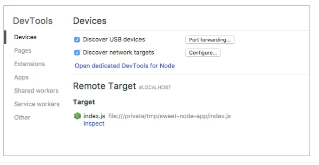

## ¿Qué es Node.js?

Es un entorno de ejecución para JavaScript basado en el motor V8 de Chrome. Permite a los desarrolladores ejecutar código JS fuera del navegador web (es decir, puedo usar JS para construir aplicaciones del lado del servidor, lo que me permite ejecutar código tanto en el lado del cliente como en el lado del servidor).  
Una aplicación Node se ejecuta en un solo proceso, no hay un nuevo hilo para cada solicitud.

De esta forma, JS se puede ejecutar en las 3 capas del desarrollo web:

- Frontend con JS en los navegadores.
- Backend con entornos de programación como Node.js.
- En la persistencia de datos, con gestores de bases de datos NoSQL como Firebase, MongoDB.

## Usos de Node.js

### En el frontend
- Para ejecutar tareas y scripts.
- Manejo de paquetes y dependencias.
- Build environment, puede ser usado como un entorno de construcción. Es común en proyectos que utilizan frameworks de frontend como Angular.
- Servidores de desarrollo locales para probar las aplicaciones antes de desplegarlas en un servidor de producción.
- Es utilizado para pruebas y automatización (unitarias, de integración y end-to-end).
- Server-side rendering (SSR), algunos frameworks permiten que el renderizado se realice del lado del servidor. Node.js es útil para habilitar este proceso.

### En el backend
- Uso de JS del lado del servidor.
- Asíncrono y no bloqueante, se basa en eventos, lo que permite manejar múltiples solicitudes y operaciones simultáneas.
- Eficiente y rápido, lo que lo hace adecuado para aplicaciones en tiempo real y de alto rendimiento.
- Escalable, el enfoque en la asincronía y la eficiencia permite que las aplicaciones escalen fácilmente sin aumentar significativamente los recursos del servidor.
- Manejo de solicitudes HTTP, permite la creación de servidores web y manejar solicitudes y respuestas HTTP.
- Multiplataforma: Windows/macOS/Linux.
- Ideal para aplicaciones en tiempo real, como chats, juegos en línea, aplicaciones de colaboración.

### En las bases de datos
- Conexión y consultas a bases de datos tanto relacionales como no relacionales.
- Desarrollo de APIs para acceso a datos, que actúan como intermediarios para el acceso y manipulación de datos.
- Middleware para manipulación de datos. En aplicaciones web, Node.js puede actuar como middleware (antes de guardar o recuperar datos de la base de datos).
- Caché, se puede utilizar para implementar estrategias de caché, donde los datos frecuentemente accedidos se almacenan en memoria.
- Procesamiento de datos en tiempo real, como actualizaciones de datos y notificaciones, gracias a su naturaleza asíncrona y no bloqueante.
- Migraciones y cambios de estructura de la base de datos, se pueden crear scripts para realizar migraciones.
- Integración con bases de datos externas y servicios.

### En el hardware
- Internet de las cosas (IoT), permite a los desarrolladores interactuar con dispositivos físicos y sensores.
- Controlar robots y drones.
- Automatización del hogar, donde se pueden conectar y controlar dispositivos electrónicos, dispositivos inteligentes y otros equipos.
- Impresoras 3D.
- Realidad virtual y realidad aumentada.

## Instalación

- Instalación binaria: Descargar un instalador precompilado específico para el sistema operativo.
- Instalación a través del gestor de paquetes del sistema (package manager).
- Instalación desde código fuente: Descargar el código fuente de GitHub, compilarlo y configurar el sistema manualmente.
- Manejo de versiones con NVM (Node Version Manager): Herramienta que permite instalar múltiples versiones de Node.js en el sistema.

Para verificar la instalación:

`node -v`

`npm -v`

## Tipos de versiones

- **LTS (Long Term Support)**: Soporte a largo plazo.
- **CURRENT**: Con las últimas características, pero con un tiempo de soporte más corto; es menos estable.

## REPL

- **READ**: Leer. Espera que el usuario ingrese una línea de código.
- **EVAL**: Evaluar. Cuando el usuario da Enter, el REPL evalúa la expresión.
- **PRINT**: Imprimir. Imprime el resultado en la pantalla.
- **LOOP**: Bucle. El REPL vuelve a esperar que el usuario ingrese código y repite el proceso.

**READ EVAL PRINT LOOP** es una herramienta interactiva que permite a los desarrolladores ejecutar y probar código JS. Es similar a la consola de los navegadores, pero se ejecuta en la línea de comandos del sistema operativo.  
Se accede escribiendo en la terminal:

`node`

Y se verá un `>`.

Para salir, escribe:

`.exit`

o presiona **Ctrl + C**.

## Diferencias entre Node.js y el navegador

Crear aplicaciones que se ejecuten en el navegador es completamente diferente a crear aplicaciones con Node.js, a pesar de que ambas usan JS.  
Usar el mismo lenguaje de programación para el frontend y backend es ventajoso.  
En el **browser** (navegador), lo que haces es interactuar con el DOM y las API de plataformas web. En Node.js, no tenemos todas las API que proporciona el navegador (como el acceso a archivos).  
En Node.js no se tienen ninguno de los objetos que proporcionan los navegadores (como `document`, `window`). Además, Node.js soporta los sistemas de módulos CommonJS (`require`) y ES Modules (`import`), mientras que el navegador está empezando a implementar los módulos ES (es decir, en el navegador solo puedes usar `import`).

## Ejecución de código

Para ejecutar un programa, escribe el comando:

`node nombredelarchivo.js`

También puedes pasar una cadena como argumento en lugar de la ruta, y lo ejecutará igual que el REPL:

`node -e 'console.log("boca")'`

`node -e "console.log(1+2)"`

Y retornará en la consola: `boca` y `3`.

Para reiniciar la aplicación automáticamente cuando se modifique un archivo:

`node --watch file.js`

Y para salir, presiona **Ctrl + C**.

Para ejecutar una tarea con Node.js, debe estar especificada en su `package.json`. Esto puede ser útil para automatizar tareas repetitivas, como ejecutar pruebas, construir proyectos o analizar código.

- Usando la bandera `--run`, permite ejecutar un comando específico en la sección `scripts` de su `package.json`:

```json
{
  "type": "module",
  "scripts": {
    "start": "node app.js",
    "dev": "node --run -- --watch",
    "test": "node --test"
  }
}
node --run test
```

## Bloqueante Vs No bloqueante

Las operaciones que impliquen esperar que algo suceda son operaciones de E/S (lectura/escritura de archivos, solicitudes HTTP, consultas a bases de datos). Dependiendo del modo en el que se ejecutan estas, se refiere a bloqueante o no bloqueante.  
**BLOQUEANTE**: En este modelo, una operación de E/S bloqueará la ejecución del programa hasta que se complete y no podrá continuar con otras tareas.  
**NO BLOQUEANTE**: En este modelo, las operaciones de E/S se ejecutan de manera asíncrona, es decir, en vez de esperar que se complete, el programa continúa con otras tareas y cuando se completa, se ejecuta el callback.  
Como Node.js usa un solo hilo para manejar múltiples solicitudes, es fundamental el modelo no bloqueante. El hilo de ejecución no se queda esperando operaciones de E/S, sino que lo utiliza para otras tareas.

## Single Thread

Por defecto, Node.js usa un único hilo de ejecución. Este es responsable de todas las operaciones y tareas del servidor. Este hilo único utiliza el enfoque no bloqueante y asíncrono. Cuando una operación de E/S se inicia, en lugar de bloquear el hilo, Node.js continúa ejecutando otras tareas y eventos. Y cuando la operación de E/S se completa, se activa el callback para manejar el resultado.

## Event Loop

El bucle de eventos permite que el servidor maneje múltiples solicitudes de manera eficiente sin bloquear el hilo. El event loop se encarga de las operaciones de entrada/salida y las devoluciones de llamadas. Cuando una operación de E/S inicia (por ejemplo, una solicitud HTTP), en lugar de bloquear la ejecución, el event loop delega la operación a un componente externo del sistema operativo y continúa ejecutando otras tareas en el hilo principal. Cuando la operación de E/S se completa, el componente externo notifica que la operación ha terminado, y el event loop agrega el callback asociado a esa operación a la cola de eventos. Posteriormente, cuando el hilo principal (stack) esté vacío, el event loop procesa la cola de eventos y ejecuta el callback.

## Módulos

Son bloques de código reutilizables y encapsulados que permiten organizar y separar funcionalidades más pequeñas y manejables. Un módulo no es más que un archivo JS. Node.js tiene muchos módulos integrados que forman parte de la plataforma (HTTP, fs, PATH).  
En Node.js existen 2 tipos de sistemas de módulos:

- **CommonJS**: Utiliza las palabras `require(ruta/al/modulo)` y `module.exports={f1,f2}` para importar y exportar módulos.
- **ECMAScript (ESM)**: A partir de Node.js v13 se agregaron los módulos ES, que utilizan la palabra `import {obj, funciones} from 'ruta/al/modulo.js'` y `export const f1=()=>{}`.  
  Para utilizar ESM en Node.js, se debe agregar el atributo `type:"module"` en el `package.json` o usar la extensión `.mjs` para los archivos que usen ESM.  
  Los archivos con extensión `.js` y `.cjs` por defecto serán tratados como módulos CommonJS.  
  Los archivos con extensión `.mjs` y los `.js` cuando el archivo `package.json` contiene `type:"module"` serán tratados como módulos ECMAScript.


## Palabra Clave GLOBAL

En los navegadores, el ámbito de nivel superior es el global y su objeto global se denomina `window`. En el navegador, con `var` definimos variables globales dentro de `window`. En Node.js, el ámbito superior no es el global y cuando declaremos con `var` será local para ese módulo.

## Aceptar la entrada desde la línea de comandos en Node.js

Para hacer que un programa CLI sea interactivo, Node.js proporciona el módulo `readline` para obtener la entrada de la terminal una línea a la vez.

```js
const readline = require("node:readline");
const r1 = readline.createInterface({
  input: process.stdin,
  output: process.stdout,
});
r1.question("¿Qué hora es?", (res) => {
  console.log("Hora: " + res);
  r1.close();
});
```

El método `question()` muestra el primer parámetro y espera la entrada, y luego llama al callback cuando el usuario presiona enter.  
El método `close()` cierra el flujo.

## NPM

Administrador de paquetes para Node.js, es un repositorio en línea para la publicación de proyectos de Node.js y, además, es una utilidad de línea de comando para interactuar con dicho repositorio.  
Se utiliza para instalar, actualizar y gestionar paquetes y dependencias de terceros en un proyecto.  
Las dependencias son fragmentos de código predefinidos, como bibliotecas y paquetes que la aplicación Node.js necesita para funcionar.

### Comandos

- Para iniciar un proyecto:
  `npm init  // Con preguntas`  
  `npm init -y  // Sin preguntas`

- Para instalar todas las dependencias si un proyecto tiene un `package.json`, lo hace en la carpeta `node_modules`:
  `npm i`  
  `npm install`

- Para instalar un solo paquete (desde npm 5, además agrega las dependencias al `package.json` e instala la última versión):
  `npm install nombre-del-paquete`

- Para instalar una versión específica de un paquete:
  `npm install [paquete]@3.4.12   // Versión específica`

- Para actualizar paquetes:
  `npm update`

- Para actualizar un paquete específico:
  `npm update [paquete]`

- Para desinstalar paquetes:
  `npm uninstall [paquete]`  
  `npm uninstall [paquete]@[versión] // Versión específica`  
  `npm un [paquete] // Shortcut`

- Para instalar como dependencia de desarrollo, en el `package.json` se agregan a `devDependencies`:
  `npm install [paquete] --save-dev`  
  `npm install [paquete] -D`

- Para instalar las dependencias explícitamente en la sección de `dependencies`:
  `npm install [paquete] --save`  
  `npm install [paquete] -S`

- Para instalar solo las dependencias de producción (si existe `package.json`) y omitir las dependencias de desarrollo:
  `npm install --production`

## Semantic Versioning

El control de versiones semántico es un estándar para el control de versiones que comunica cambios en un paquete.  
El formato es MAYOR.MENOR.PARCHE, por ejemplo: 1.2.3.

- **Mayor**: se incrementa cuando hay cambios que pueden ser incompatibles con la versión anterior.
- **Menor**: se incrementa cuando se agrega una funcionalidad pero es compatible con la versión anterior.
- **Parche**: se incrementa cuando se corrige un error.

## NPX

Es un comando disponible que permite ejecutar un comando desde un paquete npm local o remoto.  
Si alguno de los paquetes solicitados no se encuentra en las dependencias del proyecto local, se instala en una carpeta en la memoria caché de npm.  
Se usa para ejecutar paquetes temporales sin tener que instalarlos previamente (ni global ni en tu proyecto).  
`npx comando`

## Instalación Global vs Instalación Local

Node.js y npm permiten 2 formas de instalación de paquetes/dependencias: **local** y **global**.

- **Local**: cuando se instala un paquete o dependencia como parte de un proyecto, este se instalará en una carpeta en el proyecto llamada `node_modules`. Además, se agregará en el `package.json` en la sección de dependencias.  
  COMANDO: `npm install [paquete]`
  
- **Global**: esto instalaría el paquete en una ruta del sistema y los paquetes estarían disponibles para cualquier programa que se ejecute en la computadora local.  
  COMANDO: `npm install -g [paquete]`

## Carpeta node_modules

Cuando se ejecuta el comando `npm install`, npm crea una carpeta `node_modules` en la raíz del proyecto. En esta carpeta están todos los paquetes externos y dependencias que se utilizan en el proyecto.  
No se debe incluir la carpeta `node_modules` en un sistema de control de versiones (como Git), porque suele ser bastante pesada y además se puede recrear con el comando `npm install` si existe el archivo `package.json`. Para ello, se suele incluir la carpeta en el archivo `.gitignore`.

## package.json

Es un archivo de configuración del proyecto que proporciona metadatos del proyecto (nombre, versión, descripción, autor, licencia), y contiene toda la información sobre el proyecto, sus dependencias y scripts personalizados.  
Es utilizado por npm para gestionar dependencias y scripts.  
Es un archivo JSON que contiene una serie de claves y valores. Las claves más comunes son:

- **name**: nombre del proyecto
- **version**: la versión actual del proyecto
- **description**: breve descripción del proyecto
- **main**: el archivo que se debe ejecutar
- **dependencies**: un objeto que lista las dependencias de producción del proyecto
- **devDependencies**: un objeto que lista las dependencias de desarrollo
- **scripts**: un objeto que define scripts personalizados que pueden ser ejecutados desde la línea de comandos con el comando `npm run [nombre]`. Permite definir instrucciones personalizadas
- **author**: autor/s del proyecto
- **license**: bajo la que se distribuye el proyecto


## package-lock.json

Es un archivo que genera automáticamente NPM cuando se instala o actualiza una dependencia. Sirve para asegurar una instalación consistente del proyecto en diferentes entornos.

## Ejecución de Scripts

El archivo `package.json` tiene una clave `scripts` que especifica tareas de línea de comando que se pueden ejecutar mediante `npm run [nombre tarea]`. Es común colocar ahí los comandos largos bajo nombres más fáciles de ejecutar.  
Los scripts se utilizan para iniciar un servidor, iniciar la compilación de un proyecto y también para ejecutar pruebas.

```js
{
  "name": "your-package",
  "version": "1.0.0",
  "description": "",
  "main": "index.js",
  "author": "",
  "license": "ISC",
  "dependencies": {},
  "devDependencies": {},
  "scripts": {
    "echo": "echo hello!"
  }
}
```

Si ejecutamos `npm run echo` en la línea de comando, se ejecutará eso.

## Manejo de Errores

Puede haber errores operacionales y errores de programación. Para el manejo de errores es necesario desarrollar código sólido. Esto permite reducir el tiempo de desarrollo al encontrar errores y fallos más prontamente.

- **Errores operacionales**: representan problemas en tiempo de ejecución.
  - No se pudo conectar al servidor.
  - Entrada de usuario no válida.
  - El servidor devolvió respuesta 500.
  - El sistema no tiene memoria.

- **Errores de programación** o bugs: representan problemas del código en sí.
  - Cuando intentas leer una propiedad de un objeto indefinido.
  - Se llama a una función asincrona sin devolución de llamada.
  - No capturar una promesa rechazada.
  - Paso de parámetro incorrecto en una función.

Los errores operativos son parte del tiempo de ejecución y de la aplicación, mientras que los de programación son errores en el código.  
Usualmente, los errores operacionales no implican que reinicies la aplicación (si la entrada del usuario no es válida), pero si hay un error de programación, quizás no tenga sentido mantener la aplicación funcionando cuando hay un error.  
Node tiene un objeto de `Error` integrado, que te brinda un conjunto de información sobre un error cuando ocurre. Tiene un `error.stack` que proporciona un seguimiento de la pila de donde proviene el error, y un `error.message` que imprime un mensaje de error.


### Técnicas de manejo de errores

- **try-catch**: Envolvemos el bloque de código que puede producir el error, y el error se procesa en el bloque `catch` si se produce.

```js
const fs = require("fs"); // Porque no estamos trabajando con npm
try {
  const data = fs.readFileSync("/jdsdj");
  console.log(data);
} catch (error) {
  console.log(error);
}
```

- **Callback**: Es un argumento de la función en la que implementamos el manejo de errores. El propósito de una función de devolución de llamada es verificar los errores antes de que se utilice el resultado.

```js
fs.readFile("/hshaks", (err, result) => {
  if (err) {
    console.error(err);
    return;
  }
  console.log(result);
});
```

- **Promesas o async/await**: Son una alternativa al callback.  
  ```js
  const fs = require("fs/promises");

  console.log("Inicio");
  fs.readFile("/hasajh")
    .then((result) => console.log(result))
    .catch((error) => console.log(error));
  console.log("Fin");

  // ASYNC/AWAIT
  try {
    const result = await fs.readFile("/hasajh");
    console.log(result);
  } catch (error) {
    console.log(error);
  }
  // NOTA: Si se quiere usar async debe ser de tipo module o extensión .mjs
  ```

- **Emisores de eventos**: Podemos usar la clase `EventEmitter` del módulo de eventos para informar errores.

```js
const { EventEmitter } = require("node:events");
const fs = require("fs");
// emit se utiliza para desencadenar un evento
// on para agregar una función de devolución de llamada que se ejecutará cuando se active un evento

const eventEmitter = new EventEmitter();

// Creamos un evento llamado errorArchivo
eventEmitter.on("errorArchivo", (error) => {
  console.log("Error en archivo:", error);
});
eventEmitter.on("data", (result) => {
  console.log(result);
});

try {
  const data = fs.readFileSync("/nsdaks");
  // Emitimos evento
  if (data) eventEmitter.emit("data", data);
} catch (error) {
  // Emitimos evento
  eventEmitter.emit("errorArchivo", error);
}
```

### Errores personalizados por el usuario

Se pueden crear errores personalizados ampliando el objeto base `Error` para reflejar mejor los tipos de errores que podrían ocurrir en la aplicación, como `ValidationError` o `DatabaseError`. Esto se puede mejorar agregando propiedades y debe incluir suficiente información para que el controlador de errores gestione correctamente el error.

```js
class MyCustomError extends Error {
    constructor(message, cause) {
        super(message);
        // El nombre se establece con el constructor de la clase
        this.name = this.constructor.name;
        this.cause = cause;
    }
}

function test(numero) {
    if (!numero) throw new MyCustomError("Mensaje: número no pasado", "Causa: argumento undefined");

    if (numero && numero < 0) throw new MyCustomError("Negativo no válido", "Valor de número inválido");

    console.log("Sin error", numero);
}

try {
    // test();
    // test(-1);
    test(1);

} catch (error) {
    if (error instanceof MyCustomError) {
        console.log(error.message);
        console.log(error.cause);
    }
}

```

### AssertionError

Es una clase que permite realizar pruebas de aserción simples. Cuando una aserción de este tipo falla, `AssertionError` lanza un error de este tipo. `AssertionError` hereda de la clase `Error`.

```js
const assert = require("assert"); // Solicitamos el módulo
const AssertionError = require("assert").AssertionError; //

// DEFINIMOS LAS PRUEBAS
function assertStrictEquality(a, b, message = null) {
  try {
    // Output test
    console.log("--- Asserting: " + a + " === " + b + " ---");
    assert.strictEqual(a, b, message);
    // Output confirmation of successful assertion
    console.log("--- Confirmed: " + a + " === " + b + " ---");
  } catch (error) {
    if (error instanceof AssertionError) {
      console.log(error);
    } else {
      console.log(error);
    }
  }
}

function assertStrictInequality(a, b, message = null) {
  try {
    // Output test
    console.log("--- Asserting: " + a + " !== " + b + " ---");
    assert.notStrictEqual(a, b, message);
    // Output confirmation of successful assertion
    console.log("--- Confirmed: " + a + " !== " + b + " ---");
  } catch (error) {
    if (error instanceof AssertionError) {
      console.log(error);
    } else {
      console.log(error);
    }
  }
}

function executeTests() {
  console.log("+++++++++");
  assertStrictEquality(0, 1);
  console.log("+++++++++");
  assertStrictEquality(0, 1, "0 y 1 no son iguales");
  console.log("+++++++++");

  assertStrictInequality(4, 4);
  console.log("+++++++++");
  assertStrictInequality(4, 4, "4 y 4 son iguales");
  console.log("+++++++++");
  assertStrictInequality(4, 5, "4 y 5 NO son iguales"); // No se ejecuta el mensaje porque no son iguales y da true
}

executeTests();
```

La única vez que deberías experimentar un error `AssertionError` es cuando haces uso de la API de `assert`. Cada aserción de prueba debe ser simple y fácilmente ejecutable, sin intentar realizar más de una tarea a la vez. La clase `assert` proporciona métodos básicos como, por ejemplo, `assert.equal` (para probar igualdad), `assert.notEqual` (para desigualdad), `assert.ok` (para verificar la veracidad del argumento pasado), etc. Cualquiera de estos métodos, si falla, genera un error de tipo `AssertionError`.

### JS Errores

JS utiliza los errores para informar a los desarrolladores sobre diversos problemas en el script que se está ejecutando.

- Error de evaluación.
- Error de rango (número fuera de un rango permitido).
- Error de referencia (variable o elemento no existe).
- Error de sintaxis (cuando escribimos código que el motor de JS no puede entender).
- Error de tipo (cuando se realiza una operación en un tipo de datos incorrecto).
- Error URI (Uniform Resource Identifier, se produce cuando una de las funciones de manejo de URI global se utiliza mal, es decir, cuando se codifica o decodifica un URI incorrectamente).
- Error interno (ocurre cuando el motor se sobrecarga por demasiadas recursiones, demasiados datos para manejar, y la pila crece más allá de los límites).

```js
// Error de rango
const l = console.log;
try {
  const array = [90, 88];
  array.length = 90 ** 99;
} catch (error) {
  l(error.message);
}

// Error de referencia
try {
  const cat = "Garfield"; // Se escribe en un registro de entorno (clave/valor)
  l(cat); // La variable existe
  l(dog); // No existe
} catch (error) {
  l(error.message);
}

// Error de sintaxis
try {
  let gato h = "gato";
} catch (error) {
  l(error.message);
}

// Error de tipo
try {
  const numero = 123;
  numero.toUpperCase(); // toUpperCase espera un tipo cadena
} catch (error) {
  l(error.message);
}

// Error URI
try {
  decodeURI("%"); // Función que obtiene la versión no codificada de un URI. Al no ser una URI correcta, lanza URIError.
} catch (error) {
  l(error.message);
}

// Error interno
try {
  function foo() {
    foo();
  }
  foo();
} catch (error) {
  l(error.message);
}
```


### Excepciones no detectadas

Dado que Node.js se ejecuta en un único proceso, las excepciones no detectadas son un problema. Node.js sigue un patrón de devolución de llamadas en el que un objeto `Error` es el primer argumento y los datos son el segundo.

### Errores asincrónicos

Los errores siempre deben ser manejados. El manejo de errores en casos sincrónicos se realiza con `try/catch`, mientras que en el caso de trabajar de forma asincrónica se manejan dentro de la función de devolución de llamada, las abstracciones de `Promise` y `async/await`.

Existen 3 formas de manejar los errores en escenarios asincrónicos (no excluyentes):

- Rechazo
- try/catch
- Propagación

#### Rechazo

Cuando se produce un error en una función sincrónica, se trata de una EXCEPCIÓN, pero en una función asincrónica se trata de una `Promise` (un error asincrónico o un rechazo de promesa).

```js
function dividirPorDos(numero) {
  return new Promise((resolve, reject) => {
    if (typeof numero !== "number") {
      reject(new TypeError("El argumento debe ser un número"));
      return;
    }
    resolve(numero / 2);
  });
}
// dividirPorDos("2") // Esto generaría un error
dividirPorDos(2)
  .then((resul) => console.log(resul))
  .catch((e) => console.log(e.message));
// Si aparece un throw dentro de un controlador de promesa, then o catch devolverá una promesa rechazada
```

#### try/catch asincrónico

La sintaxis `async/await` admite `try/catch` para manejar rechazos.

```js
async function dividirPorDosAsync(params) {
  if (typeof params !== "number") throw new TypeError("Argumento no válido");

  return params / 2;
}

// La función asincrónica devuelve una promesa que se resuelve a menos que se produzca un rechazo
async function test() {
  try {
    let r = await dividirPorDosAsync("2");
    console.log(r);
  } catch (error) {
    console.log(error);
  }
}
```


#### Propagación

En lugar de gestionar el error en el lugar donde se produce, el autor de la llamada es el responsable de gestionarlo. Cuando usamos `async/await` y queremos propagarlo, lo volvemos a generar.

```js
async function testPropagacion() {
  try {
    let r = await dividirPorDosAsync("2");
    console.log(r);
  } catch (error) {
    console.log(error.message);
    if (error instanceof TypeError) throw new Error("Generó otro error");
  }
}
testPropagacion();
```

### Seguimiento de pila

Para imprimir un seguimiento de la pila de llamadas desde el último al primero (LIFO). El *stacktrace* se muestra cuando se produce un error inesperado. Con `try/catch` capturamos la excepción y en la propiedad `stack` contiene una cadena con el seguimiento de la pila de llamadas en orden LIFO.

```js
console.log(new Error("mi error").stack);
```

### Debugger

Node.js incluye una utilidad de depuración en la línea de comandos que permite realizar inspecciones sencillas. Para usarlo, inicia Node.js con el argumento `--inspect` seguido de la ruta que deseas depurar.

```bash
node --inspect [nombre del script].js
```

Ahora abre el navegador e ingresa la URL `chrome://inspect` y, desde esa ventana, podrás depurar el código línea por línea. Si se desea, se puede agregar un script para depurar la aplicación en el `package.json`.

```json
"scripts": {
    "start": "node index.js",
    "debug": "node --inspect index.js",
    "dev": "nodemon index.js"
}
// Ahora ejecutas `npm run debug` para iniciar la aplicación en modo depuración
```

## Programación Asíncrona ⏰

El código asincrónico significa que se procesa en segundo plano independientemente del flujo principal del programa. Esto garantiza la ejecución de código sin bloqueos. El problema básico de las funciones sincrónicas de larga duración es que nuestro programa no responde.

### Event Loop (bucle de eventos)

El event loop permite a Node.js realizar operaciones sin bloqueo a pesar de que JavaScript use un solo hilo. 

Cuando invocamos una función, esta se agrega a la pila (stack) de llamadas (LIFO: primero en entrar, último en salir). Cuando termina de ejecutarse (con un `return`), se extrae de la pila. Pero en el caso de las operaciones asincrónicas, no pasan por la pila de llamadas. En su lugar, van a una API, lo que permite continuar con la ejecución del código una vez que el stack se libera.

Mientras tanto, en la API se ejecuta la función asincrónica, pero su devolución de llamada (callback) no se agregará inmediatamente en la pila de llamadas, sino que pasará a una cola (FIFO: primero en entrar, primero en salir) de devoluciones de llamadas. 

Ahora, es el bucle de eventos quien conecta la cola con la pila de llamadas. Si la pila está vacía (es decir, no hay funciones sincrónicas ejecutándose), el primer elemento de la cola se agregará a la pila de llamadas, se invocará, devolverá un valor y se extraerá de la pila.


### Emisor de eventos

Los emisores de eventos son objetos en Node.js que activan un evento enviando un mensaje para indicar que se completó una acción. Normalmente, en Node.js, cuando queremos que se produzca una acción al completarse otra acción, usamos la técnica de programación asíncrona con callbacks o encadenamiento de promesas. Sin embargo, estas técnicas acoplan la acción desencadenante y la acción resultante. En el caso de los eventos, el emisor de eventos envía un mensaje y un suscriptor recibe el evento y realiza una acción. (El emisor no necesita saber de los suscriptores).

Del lado del navegador, parte de la interacción del usuario se maneja a través de eventos. Del lado del backend, Node.js ofrece la opción de construir un sistema similar con el módulo `events` y con la clase `EventEmitter`.

```js
// Cargamos el módulo e importamos la clase EventEmitter
const EventEmitter = require("node:events");

// Creamos una instancia de un objeto emisor de eventos
const miEvent = new EventEmitter();
// Este objeto expone muchos métodos, entre ellos `on` y `emit`

// `emit` se utiliza para activar un evento. Necesitamos pasarle el nombre del evento como una cadena, y podemos
// pasar cualquier cantidad de argumentos después del nombre del evento.
// La función devuelve `true` si hay oyentes para el evento y `false` si no hay.
console.log(miEvent.emit("miEvent"));

// `on()` agrega un detector para un evento con un nombre de evento en particular y activa la devolución de llamada cuando se activa el evento.
// `on` se utiliza para agregar una función de devolución de llamada que se ejecutará cuando se active el evento.
// Se utiliza para agregar receptores. Cuando se registra ese oyente, se invoca cada vez que se emite el evento nombrado.
let m = 0;
miEvent.on("start", (argumento) => {
  console.log(++m);
  console.log("Evento start", argumento);
});
miEvent.on("second", () => console.log("Second"));
miEvent.on("last", () => console.log("Last"));

console.log(miEvent.emit("start", 2025));

miEvent.emit("start", 2025);
miEvent.emit("start", 2025);

// `once` registra un oyente que se llama solo una vez para un evento en particular.
// Una vez emitido el evento, se anula el registro del detector.
miEvent.once("once", () => {
  console.log("Once", (m += 1));
});
miEvent.emit("once");
miEvent.emit("once"); // Es ignorado

// Otra forma de crear eventos es crear un objeto que extienda de la clase EventEmitter.
// Esto significa que la clase hereda los métodos y propiedades de la clase `EventEmitter`.
class ClaseEvento extends EventEmitter {
  constructor() {
    super();
  }

  pasoAlgo(param) {
    // Emitimos el evento `pasoAlgo` cuando se llama a la función `pasoAlgo` de la clase.
    this.emit("pasoAlgo", param);
  }

  // MANEJO DE EVENTOS DE ERROR
  // Si un emisor de eventos no puede realizar su acción, debe emitir un evento
  // para indicar que la acción falló. La forma estándar de Node.js en que un emisor de eventos
  // indica una falla es emitiendo un `Error` Event.
  // Un evento de error debe tener su nombre establecido en "error", y estar acompañado de un objeto `Error`.

  pasoAlgoErroneo(num) {
    if (num < 0) {
      this.emit("error", new Error("Número negativo inválido"));
      return;
    }
    this.emit("pasoAlgoError");
  }
}

// Ahora que ya tenemos todo para enviar eventos, creamos detectores de eventos con `on()`.
const listener = new ClaseEvento(); // Creamos un objeto emisor de evento.
listener.on("pasoAlgo", (arg) => {
  console.log("👀", arg);
});
listener.pasoAlgo("👍"); // Llamamos a la función que internamente emite el evento.


// Se considera una buena práctica escuchar siempre los eventos "error" si estás escuchando un emisor de eventos.
// Si no configuras un detector de errores, toda la aplicación se bloqueará al emitir uno.
listener.on("error", (error) => {
  console.log(error.message);
});
listener.on("pasoAlgoError", () => console.log("pasoAlgoError"));
// Invocamos la función que emite el evento: si el número es menor a cero, emite "error", y si es mayor o igual, emite "pasoAlgoError".
listener.pasoAlgoErroneo(1);
listener.pasoAlgoErroneo(-1);

// GESTIÓN DE OYENTES DE EVENTOS
/* Los emisores de eventos tienen mecanismos para supervisar y controlar los oyentes
suscritos a un evento.
Para saber cuántos oyentes están procesando un evento, tenemos el método
listenerCount("nombre de evento"). */
const listener2 = new ClaseEvento();
listener2.on("pasoAlgo", (arg) => {
  console.log("Listener2 🌡️", arg);
});
listener2.on("pasoAlgo", (arg) => {
  console.log("Listener2 🌡️🌡️", arg);
});
// Cada objeto tiene su propia instancia de evento.
console.log("Listener1", listener.listenerCount("pasoAlgo")); // 1
console.log("Listener2", listener2.listenerCount("pasoAlgo")); // 2, tiene dos oyentes esta instancia del objeto EventEmitter

// Si queremos eliminar los oyentes, podemos usar la función `off()` para eliminar los detectores de eventos de un emisor de evento.
// El método `off()` acepta dos argumentos: el nombre del evento y la función que lo está detectando (por lo que, para eliminar
// la devolución de llamada, debe guardarse en alguna variable o constante).

const devolucionLLamada = (arg) => {
  console.log("Listener2 🌡️🌡️🌡️", arg);
};
listener2.on("pasoAlgo", devolucionLLamada);

listener2.pasoAlgo("🔥"); // Se emiten las 3 devoluciones de llamadas.
listener2.off("pasoAlgo", devolucionLLamada); // Quitamos una devolución de llamada, no las otras.
listener2.pasoAlgo("🔥"); // Se emiten las 2 devoluciones de llamadas restantes.

// Si queremos eliminar todos los oyentes de un evento, podemos usar la función
// `removeAllListeners("nombre del evento")`.
listener2.removeAllListeners("pasoAlgo");
console.log(listener2.listenerCount("pasoAlgo")); // 0, sin oyentes
listener2.pasoAlgo("🔥"); // No debería pasar nada.


### Promesas

Una promesa es un objeto que representa el resultado de una operación asincrónica. Las funciones asincrónicas utilizan promesas en segundo plano. Una promesa puede estar en uno de tres estados diferentes:

- Pendiente: estado inicial de una promesa.
- Cumplida: estado que representa una operación exitosa.
- Rechazada: estado que representa una operación fallida.
  
Una vez que la promesa se cumple o se rechaza, es inmutable, es decir, no se puede cambiar.

#### Construcción de una promesa

Para construir una promesa usamos `new Promise(function(resolve, reject))`. Usando `resolve()` y `reject()` podemos comunicar al llamador cuál fue el estado de la promesa resultante. Para poder utilizar una promesa, debemos esperar que se cumpla o se rechace. Usamos `then()` para manejar el caso en que se cumpla y `catch()` para manejar el caso en que se rechace.

```js
function creandoPromesa(argumento) {
  return new Promise(function (resolve, reject) {
    setTimeout(() => {
      if (argumento > 0) {
        resolve(argumento);
      } else {
        reject("Error");
      }
    }, 3000);
  });
}

console.log("Inicio");
creandoPromesa(0).then(console.log).catch(console.log);
console.log("FIN");
```

#### Promesas encadenadas

El método `then()` toma dos argumentos: el primero es una callback para el caso en que se resuelva la promesa, y el segundo es una función de devolución de llamada si la promesa se rechaza. Cada `then()` devuelve un objeto `Promise` que se puede usar para encadenar más promesas. Sin embargo, es más sencillo omitir el manejo de errores hasta una sentencia `catch()`.

```js
myPromesa
  .then((valor) => {
    throw new Error("💥");
  })
  .then((valor) =>
    console.log("No pasó por acá... porque el error va al catch")
  )
  .catch((error) => console.log(error.message));
```

### Async/Await

`Async/await` es una sintaxis especial para trabajar con promesas. Se debe agregar la palabra `async` antes de una función, lo que garantiza que la función devuelva una promesa. La palabra clave `await` hace que JavaScript espere hasta que se cumpla la promesa, mientras pasa el flujo de ejecución al código que invocó la función asincrónica. De esta forma, no se bloquea el flujo del programa.

Definición de funciones asincrónicas:

- Declaración de función `async`.
- Expresión de función `async`.

```js
async function f(params) {
  return params;
}
const f2 = async (params) => {
  return params;
};
console.log(f2("🐶​")); // Si ejecuto no pasa nada porque no la manejé como una promesa.
f2("🐶​").then(console.log);

let valor = await f("🐷​"); // La palabra clave `await` hace que JavaScript espere hasta que se cumpla esa promesa y devuelva su valor.
console.log(valor);
```

Cuando se llama a la función, esta devuelve un elemento `Promise`. Si la promesa se resuelve exitosamente, el resultado se incluye en esta. Si la función `async` genera una excepción, la promesa se rechaza con el valor generado.

Una función `async` puede contener una expresión `await`, la cual pausa la ejecución de la función asincrónica y espera la resolución de la promesa. Luego, reanuda la ejecución de la función `async`. La palabra clave `await` solo funciona dentro de funciones `async`. `Await` suspende la ejecución de la función hasta que se cumpla la promesa y cede el flujo del programa al código que invocó la función asincrónica.

Podemos declarar métodos de clase asíncronos poniendo `async`.

```js
class MyClass {
  async f3() {
    return await Promise.resolve("🍄");
  }
}
new MyClass().f3().then(console.log); // Manejo como promesa
(async () => {
  let r = await new MyClass().f3();
  console.log(r);
})(); // Manejo a través de una función asincrónica anónima, ya que para usar `await` debo estar dentro de una función `async`.
```

### Manejo de errores

Si una promesa se rechaza, arroja el error como si hubiera un `throw`.

```js
// Estas dos hacen lo mismo:
async function eF() {
  try {
    await Promise.reject(new Error("💥"));
  } catch (error) {
    console.log(error.message);
  }
}

async function eF2() {
  throw new Error("💥");
}

async function eF3() {
  await Promise.reject(new Error("☠️"));
}
// Podemos detectar ese error usando `try...catch` dentro de la función o fuera de ella.
eF();
eF3().catch((e) => console.log(e.message)); // Catch de promesa
try {
  console.log(await eF3());
} catch (error) {
  console.log(error.message);
}
```

### Callback (Devoluciones de llamadas)

Un **callback** es una función que se llama al finalizar una tarea. Es una función que se pasa a otra como argumento, y luego se invoca dentro de la función externa para completar algún tipo de rutina o acción. 

A menudo, los callbacks se utilizan para continuar la ejecución del código después de que se haya completado una operación. De esta forma, se evita cualquier bloqueo y permite que otro código se ejecute mientras tanto (callback asincrónico).

JavaScript es sincrónico de manera predeterminada y tiene un solo subproceso. Las líneas de código se ejecutan una tras otra. JavaScript nació dentro del navegador, que ofrece un conjunto de APIs que pueden gestionar la asincronía. Más recientemente, Node introdujo un entorno de E/S sin bloqueo para extender este concepto al acceso a archivos, llamadas a red, etc.

Como no se puede saber cuándo un usuario hará clic en un botón, se define un controlador de eventos para el evento `click`. Este controlador acepta una función que se llamará cuando se active el evento. Esta es la llamada devolución de llamada: simplemente una función que se pasa como valor a otra función. Podemos hacer esto porque JavaScript tiene funciones de primera clase.

Las devoluciones de llamadas se utilizan en todas partes, no solo en eventos DOM:

- Con el uso de temporizadores (`setTimeout`, `setInterval`).
- Solicitudes XHR.
- Trabajo con archivos.

```js
function saludar(nombre) {
  console.log("Hola " + nombre + " 😉​");
}

function despedir(nombre) {
  console.log("Chao " + nombre + " 🖐️​");
}

function funcionOrdenSuperior(callback, nombre) {
  console.log("Función de orden superior");
  callback(nombre);
}

// Callback sincrónicos, se ejecutan inmediatamente
console.log("Inicio sincrónico");
funcionOrdenSuperior(saludar, "Rosa");
funcionOrdenSuperior(despedir, "Rosa");
console.log("Fin sincrónico");

// Callback asincrónicos
console.log("Inicio async");
setTimeout(() => {
  // Callback
  despedir("Rosa");
}, 3000);
console.log("Fin async");
```

#### ¿Cómo se manejan los errores con la devolución de llamada?

Node adoptó la estrategia de poner como primer parámetro en cualquier función de devolución de llamadas el objeto `error`. Si no hay error, el objeto es `null`; si hay un error, contiene la información sobre el mismo.

```js
// Manejo de error en el primer parámetro del callback (objeto error)
const fs = require("node:fs");
fs.readFile("/file.json", (error, data) => {
  if (error) {
    // Manejo de error
    console.log(error.message);
    return;
  }
  // Sin errores
  console.log(data);
});
```

A partir de ES6, JavaScript introdujo varias características que ayudan con el código asincrónico, que no implican el uso de devoluciones de llamadas: **promesas** (ES6) y **async/await** (ES2017).


### `setTimeout`

Es una función que ejecuta otra función después de que transcurre un periodo especificado. Los tiempos se declaran en milisegundos. Se debe especificar una función de devolución de llamada para que se ejecute más tarde. `setTimeout` devuelve un valor entero positivo que identifica el temporizador creado por la llamada a `setTimeout()`. Este valor se puede pasar a `clearTimeout()` para cancelar el tiempo de espera.

```js
console.log("inicio");
setTimeout(function () {
  console.log("uno");
}, 2000); // Pasando una función anónima
setTimeout(function () {
  console.log("dos");
}, 1000);
setTimeout(function () {
  console.log("tres");
}, 50);
console.log("fin");

function callback() {
  console.log("⌛");
}
setTimeout(callback, 3000); // Pasando el nombre del callback
let id = setTimeout(callback, 3000); // Obtenemos el id de setTimeout
clearTimeout(id); // Cancela la ejecución de setTimeout

console.log("antes");
setTimeout(() => {
  console.log("sin tiempo de espera👁️");
}, 0);
console.log("después");

// Aunque se ponga cero como tiempo de espera, la función de devolución de llamada se ejecutará lo antes posible,
// pero no antes de que se ejecute el código actual. No pasa por la API ni el Event Loop, sino que va directamente al stack.
```

### `setInterval`

Método que ayuda a ejecutar repetidamente una función después de un retraso fijo. Devuelve un id de intervalo único que la función `clearInterval()` puede utilizar para detener la ejecución repetida de la función. El tiempo especificado está en milisegundos.

### `process.nextTick()`

Cada vez que el bucle de eventos realiza un recorrido completo, lo llamamos un "tic". Cuando pasamos una función a `process.nextTick()`, le indicamos al motor de JavaScript que invoque esta función al final de la operación actual, antes de que comience el siguiente tic del bucle de eventos. 

El bucle de eventos está ocupado procesando el código de la función actual. Cuando esta operación finalice, el motor de JavaScript ejecutará todas las funciones pasadas a `nextTick()`. Es la forma en que podemos decirle al motor de JS que procese una función asincrónica lo antes posible, sin ponerla en la cola.

La llamada `setTimeout(() => {}, 0)` ejecuta la función al final del siguiente tic, mucho más tarde que cuando se usa `nextTick()`, porque `setTimeout` prioriza la llamada y la ejecuta justo antes del comienzo del siguiente tic.

Usa `nextTick()` si deseas asegurarte de que el código se ejecute en la próxima iteración del bucle de eventos.

```js
console.log("number 1");
setTimeout(() => console.log("number 2"));
setTimeout(() => console.log("number 3"));
process.nextTick(() => console.log("number 4"));
console.log("number 5");

// Output: 1, 5, 4, 2, 3
```


## Archivos 📂

Se puede manipular archivos en Node.js con el módulo integrado `fs`, el cual contiene funciones para leer, escribir y eliminar archivos en la máquina local. Este aspecto hace que JS sea un lenguaje útil para la programación de herramientas de interfaz de línea de comando y back-end.  
El módulo admite la interacción con archivos de forma sincrónica, asincrónica o mediante secuencias.

#### Lectura de archivos con `readFile()`

Primero se debe importar el módulo que permite que el programa trabaje con archivos.  
Cuando se creó el módulo `fs`, la forma principal de escribir código asíncrono en Node era a través de callbacks. A medida que las promesas se hicieron populares, el equipo de Node trabajó para admitirlas en el módulo `fs`. En la versión 10 de Node crearon un objeto `promises` en el módulo `fs`, mientras que el módulo principal continúa exponiendo funciones que usan callbacks.  
Para importar la versión de promesas del módulo:  
`const fs = require('fs').promises;`  
Una vez que se importa el módulo, podemos crear funciones asíncronas para leer el archivo utilizando `await` en lugar de encadenar la promesa con `then()`.

```js
async function readFile(fileName) {
  try {
    // `readFile` devuelve un objeto Buffer que puede almacenar cualquier tipo de archivo. 
    // Puedes convertir esos bytes en texto mediante el método `toString()` del objeto Buffer.
    const data = await fs.readFile(fileName);
    console.log(data.toString());
  } catch (error) {
    console.log("No se pudo leer el archivo:", error.message);
  }
}
readFile("./test-lectura.txt");
```

#### Escribir archivos con `writeFile()`

```js
// ESCRITURA
async function createCSV(header, name) {
  try {
    const csvHeader = header; // name,age,city
    await fs.writeFile(name, csvHeader);
    // 1er argumento: la ruta del archivo. Si solo proporcionas el nombre, Node creará el archivo en el mismo directorio en el que se está ejecutando el código.
    // 2do argumento: son los datos que se escriben.
  } catch (error) {
    console.log("Error en la creación del archivo:", error.message);
  }
}

async function addItemCSV(param, name) {
  try {
    const csvLine = "\n" + param; // Si el header es name,age,city => rosa,30,quilmes
    await fs.writeFile(name, csvLine, { flag: "a" });
    // El 3er argumento es un objeto con una clave `flag` cuyo valor es "a". Esto le indica a Node que agregue algo al archivo en lugar de sobreescribirlo.
    // Si no se especifica el valor, el valor predeterminado es "w", que crea un archivo nuevo si no existe o lo sobreescribe si existe.
  } catch (error) {
    console.log("Error al agregar un ítem al archivo:", error.message);
  }
}

// ES MODULE
// Para usar esta sintaxis, el archivo debe ser `.mjs`, tener `type: module` en el `package.json`, y la importación debe ser: 
// `import { promises as fs } from "fs";`
await createCSV("id,nombre,edad", "user.csv");
await addItemCSV("1,anya,44", "user.csv");
await addItemCSV("2,mara,12", "user.csv");
await addItemCSV("3,andres,28", "user.csv");

// COMMON.JS
// Si no estás trabajando con módulos `.mjs`, debes encapsular las funciones asincrónicas en una función async anónima.
// Además, se incluye entre paréntesis para indicar a JS que el código dentro de ellos es una expresión de función. Los paréntesis finales se usan para invocar inmediatamente la expresión de función (IIFE).

(async () => {
  await addItemCSV("4,lucas,18", "user.csv");
  await addItemCSV("5,tomas,56", "user.csv");
})();
```


#### Eliminar archivo con `unlink()`

```js
async function deleteFile(path) {
  try {
    await fs.unlink(path);
    // Se pasa la ruta del archivo que desea eliminar. NO lo envía a la papelera, sino que lo elimina de forma permanente del sistema.
  } catch (error) {
    console.log("Error en la eliminación del archivo:", error.message);
  }
}
deleteFile("user.csv"); // Si no se indica ruta, se busca en la carpeta donde se ejecuta el código.
```

#### Mover archivos con `rename()`

Puedes usar la función `rename()` para mover un archivo a una nueva carpeta. Se debe proporcionar la ruta del archivo original y la ruta de la ubicación de destino.

```js
async function moveFile(source, destination) {
  try {
    await fs.rename(source, destination);
    console.log("Archivo movido desde " + source + " a " + destination);
  } catch (error) {
    console.log("Ocurrió un error al mover el archivo:", error.message);
  }
}
moveFile("copy-test.txt", "./move/newname.txt"); // Se mueve desde la ubicación original y se coloca en el destino con el nombre indicado.
```

### Módulo `FS`

`FS` es el módulo integrado de Node que permite interactuar con el sistema de archivos mediante JavaScript. Todas las operaciones de archivos tienen formas sincrónicas, de callback y basadas en promesas, y se puede acceder a ellas mediante la sintaxis de CommonJS o ES Modules.

```js
// CommonJS
// const fs = require("fs");

import fs from "fs"; // ES Module

// Sincrónico
console.log("Inicio lectura sincrónica");
const data = fs.readFileSync("test-lectura.txt");
console.log(data); // Buffer
console.log(data.toString().trim());
console.log("Fin lectura sincrónica");

console.log("Inicio lectura asincrónica");
fs.readFile("test-lectura.txt", (error, data) => {
  console.log(data.toString().trim());
});
console.log("Fin lectura asincrónica");

// CREACIÓN

// `appendFile`
console.log("Inicio creación archivo sincrónica");
fs.appendFileSync(
  "appendFile.txt",
  "Si el archivo no existe, lo crea y agrega el contenido; si existe, solo agrega contenido."
);
console.log("Fin creación archivo sincrónica");

console.log("Inicio creación archivo asincrónica");
fs.appendFile(
  "appendFile.txt",
  "Si es asincrona, necesita un callback como tercer argumento.",
  function (err) {
    if (err) console.log(err.message);
  }
);
console.log("Fin creación archivo asincrónica");

// `open`
console.log("Inicio creación con `open` sincrónico");
fs.openSync("opensync.txt", "w"); // Segundo argumento es una bandera que especifica el modo de apertura. "w" indica escritura y, si no existe, lo crea vacío.
console.log("Fin creación con `open` sincrónico");

console.log("Inicio creación con `open` asincrónico");
fs.open("openasync.txt", "w", (error, file) => {
  if (error) console.log("Error en la creación del archivo");
}); // Tercer argumento: callback para manejar errores.
console.log("Fin creación con `open` asincrónico");

// `writeFile`
// Método reemplaza el archivo y el contenido si existe. Si no existe, se creará un nuevo archivo con el contenido.
console.log("Inicio creación con `writeFile` sincrónico");
fs.writeFileSync("writefilesync.txt", "Contenido de `writeFileSync`");
console.log("Fin creación con `writeFile` sincrónico");

console.log("Inicio creación con `writeFile` asincrónico");
fs.writeFile(
  "writefileasync.txt",
  "Contenido de `writeFile` (asincrónico)",
  function (err) {
    if (err) console.log("Error en la creación del archivo");
  }
);
console.log("Fin creación con `writeFile` asincrónico");

// ACTUALIZAR ARCHIVOS

// `appendFile` agrega el contenido del 2° argumento al final del archivo especificado en el 1° argumento.

console.log("Inicio actualización con `appendFileSync`");
fs.appendFileSync("opensync.txt", "Contenido agregado con `appendFileSync`");
console.log("Fin actualización con `appendFileSync`");

console.log("Inicio actualización con `appendFile` asincrónico");
fs.appendFile(
  "opensync.txt",
  "Contenido agregado con `appendFile` asincrónico",
  function (e) {
    if (e) console.log("Error al agregar contenido al archivo");
  }
);
console.log("Fin actualización con `appendFile` asincrónico");

// ELIMINAR ARCHIVO
console.log("Inicio eliminación sincrónica");
fs.unlinkSync("opensync.txt");
console.log("Fin eliminación sincrónica");

console.log("Inicio eliminación asincrónica");
fs.unlink("openasync.txt", (err) => {
  if (err) console.log("Error en la eliminación del archivo");
});
console.log("Fin eliminación asincrónica");

// CAMBIAR NOMBRE
console.log("Inicio cambio de nombre sincrónico");
fs.renameSync("writefileasync.txt", "writeFileAsync.txt");
console.log("Fin cambio de nombre sincrónico");

console.log("Inicio cambio de nombre asincrónico");
fs.rename("writefilesync.txt", "writeFileSync.txt", (err) => {
  if (err) console.log("Error al cambiar el nombre del archivo");
});
console.log("Fin cambio de nombre asincrónico");
```

### Módulo `path`

El módulo `path` proporciona utilidades para trabajar con rutas de archivos y directorios. Está integrado en el núcleo de Node.js y se puede usar solicitándolo de la siguiente manera: `const path = require('node:path')`.

- `dirname`: Obtiene la carpeta principal de un archivo.
- `basename`: Obtiene la parte del nombre del archivo.
- `extname`: Obtiene la extensión del archivo.

```js
const path = require("node:path");
const ruta = "./files/path.js";
console.log(path.dirname(ruta));  // Obtiene la carpeta principal de la ruta.
console.log(path.basename(ruta)); // Obtiene el nombre del archivo.
console.log(path.extname(ruta));  // Obtiene la extensión del archivo.

// Puedes obtener el nombre del archivo sin la extensión especificando un segundo argumento en basename.
console.log(path.basename(ruta, path.extname(ruta))); // Obtiene el nombre sin extensión.
```

Para unir 2 o más partes de rutas puedes usar `path.join()`:

```js
const name = "rosa";
const join = path.join("/", "users", name, "usuarios.txt"); // /users/rosa/usuarios.txt
console.log(join);
```

Para crear rutas absolutas, usa `path.resolve()`:

```js
console.log(path.resolve("path.js"));
// Si solo se coloca el nombre del archivo, crea la ruta absoluta al directorio actual.

// Si especificas una segunda carpeta como parámetro, `resolve` utilizará la primera como base de la segunda.
console.log(path.resolve("introduccion", "path.js")); // ....../introduccion/path.js

// Si ponemos "/" en el primer parámetro, lo toma como ruta absoluta.
console.log(path.resolve("/introduccion", "path.js")); // /introduccion/path.js

// `resolve` NO comprueba si la ruta existe. Solo calcula una ruta en función de la información que se le suministra.
```

### `process.cwd()`

Devuelve un string con el directorio de trabajo actual del proceso de Node.js. `process.cwd()` es un método del objeto global `process`, que devuelve el valor del directorio donde se ejecuta el proceso de Node.js.

**Nota:** `__dirname` no es global, sino local para cada módulo. Es decir, devuelve el valor del directorio donde reside el archivo que se está ejecutando actualmente. En cambio, `process` es un objeto global, y `cwd` retorna donde se ejecuta el proceso de Node.js.

**`__dirname`** es del módulo y representa la ruta del archivo del módulo.

```js
const { cwd } = require("node:process");
console.log("cwd:", cwd());
// Devuelve el directorio desde el que se invocó el comando `node`.

console.log("__dirname:", __dirname);
// Devuelve el nombre del directorio que contiene el archivo de código fuente de JS.

/*
  workspace
    -- files
        --- proccess-cwd.js

        Si ejecuto desde `cd files; node proccess-cwd.js`
            cwd -> c:/course/workspace/files
            __dirname -> c:/course/workspace/files

        Si ejecuto desde `workspace cd workspace; node files/proccess-cwd.js`
            cwd -> c:/course/workspace
            __dirname -> c:/course/workspace/files
*/
```


### `__dirname`

En Node.js, `__dirname` devuelve la ruta de la carpeta donde reside el archivo JS actual. Es decir, el nombre del directorio del archivo que se está ejecutando actualmente. Es lo mismo que `path.dirname(__filename)`.

```js
console.log("path.dirname(__filename)", path.dirname(__filename));
```

### `__filename`

Devuelve el nombre del archivo del código ejecutado y proporciona la ruta absoluta del archivo de código.

```js
console.log("__filename", __filename);
```

### CHOKIDAR

Es un paquete de código abierto que permite observar archivos en Node.js. Le asignas un conjunto de archivos, los observa para detectar cambios y notifica cada vez que se edita un archivo o se crea un archivo nuevo. Chokidar iniciará observadores de forma recursiva para todo lo que esté dentro del alcance de las rutas especificadas, por lo que hay que tener cuidado con los recursos del sistema.

### Aplicación de Línea de Comando ⌨️​ 

Son aplicaciones que se pueden ejecutar desde la línea de comandos. Se denominan aplicaciones CLI (Command Line Interface). Los usuarios pueden interactuar mediante comandos de terminal. Son útiles para la automatización y la creación de herramientas. 

Si te encuentras haciendo las mismas cosas una y otra vez, es probable que puedas automatizar esos pasos en un script y ahorrar tiempo.

Node.js tiene bibliotecas integradas para leer y escribir archivos, iniciar otras aplicaciones y realizar comunicaciones de red básicas.

#### Para ejecutar un script desde cualquier lugar

Crea una carpeta e inicialízala con `npm init`, crea una carpeta llamada `bin` y agrega en esa carpeta un archivo `index.js` con el siguiente contenido:

```js
#!/usr/bin/env node
console.log("first script");
```

La primera línea se llama **shebang** `#!` seguida de la ruta al shell. Es una secuencia de caracteres que indica al sistema operativo qué intérprete debe usar para ejecutar el script. El shell lo utiliza para decidir qué intérprete ejecutará el resto del script. Normalmente, será:

```bash
#!/bin/bash
```

o

```bash
#!/usr/bin/env bash
```

como la primera línea al escribir o leer scripts en bash.

En nuestro caso, usaremos esta sintaxis para que los scripts de Node.js se instalen y ejecuten correctamente en macOS y Windows.

En el `package.json`, cambia la clave `main` por el valor `bin/index.js` y agrega una nueva clave `bin` con el comando y el script a ejecutar:

```json
{
  "name": "first-app",
  "version": "1.0.0",
  "main": "bin/index.js",  // El primer archivo a ejecutarse
  "scripts": {
    "test": "echo \"Error: no test specified\" && exit 1"
  },
  "keywords": [],
  "author": "",
  "license": "ISC",
  "description": "",
  "bin": {
    "hola": "./bin/index.js"
  }
}
```

Ahora, puedes ejecutar el script como cualquier aplicación de Node usando `node .` desde la línea de comandos. Para que el script se pueda ejecutar desde cualquier lugar, debemos instalarlo globalmente con:

```bash
npm i -g
```

De esta forma, todos los comandos que aparecen en la sección `bin` del archivo `package.json` estarán disponibles como aplicaciones de línea de comando. Es decir, puedes ejecutar el script colocando el comando `hola` en este caso.

Para desinstalar un script, ejecuta el comando:

```bash
npm uninstall -g [nombre de la carpeta del proyecto]
```

Para ver todos los módulos de Node.js instalados globalmente, ejecuta:

```bash
npm ls -g --depth=0
```

> **NOTA**: Si no se ejecuta en PowerShell, abre PowerShell como administrador y verifica con el comando `Get-ExecutionPolicy`. Si muestra "Restricted", tendrás que modificar la configuración. Escribe en la terminal:

```bash
Set-ExecutionPolicy Unrestricted
```

Y luego responde "S" para modificar la configuración.

### Exit / Exit Codes

La forma de finalizar un proceso en Node.js es mediante el módulo `process` de Node.

```js
const process = require("node:process");
process.exitCode = 1;  // Será el código de salida del proceso cuando éste salga correctamente o se llame a process.exit() sin ningún código como parámetro.

process.exit();  // Si se pasa un código, se anulará la configuración de process.exitCode.
```

`process.exit` le indica a Node que finalice el proceso de forma sincrónica con un código de salida. Si no se pasa ningún código, el proceso usa el código de éxito `0` o el valor de `exitCode` si se ha establecido. La llamada a `process.exit` forzará al proceso a salir lo más rápido posible, incluso si aún hay operaciones asincrónicas que no se han completado.

En la mayoría de las situaciones, no es necesario llamar a `process.exit()`. El proceso de Node saldrá por sí solo si no hay trabajo adicional pendiente. La propiedad `process.exitCode` se puede configurar para indicarle al proceso qué código de salida utilizar cuando éste termine correctamente.


#### Evento `exit`

El evento `exit` se emite cuando el proceso de Node.js está a punto de salir como resultado de:

- La llamada exitosa a `process.exit()`
- El bucle de eventos de Node ya no tiene trabajo adicional.

No hay forma de evitar la salida. La función callback del oyente se invoca con el código de salida especificado por `process.exitCode` o por el argumento pasado en `process.exit(arg)`.

```js
const process = require("node:process");
process.on("exit", (code) => {
  console.log("🔄 Evento de salida del proceso, code: ", code);
});
process.exit(); // Por defecto, el código de salida es 0.
```

### Variables de entorno

Las variables de entorno nos permiten gestionar la configuración de nuestras aplicaciones de forma independiente de nuestro código. Separar las configuraciones facilita la implementación de nuestras aplicaciones en diferentes entornos.

Las variables de entorno son variables externas a nuestra aplicación que residen en el sistema operativo o en el contenedor donde se ejecuta la aplicación en producción. Debido a que el desarrollo se realiza principalmente en máquinas locales, las variables de entorno se colocan en entornos locales con comandos como `set` o `export`, o se almacenan en el archivo local `.env`.

Por convención, las variables de entorno se escriben en letras mayúsculas. Algunos datos de configuración que se almacenan en variables de entorno son:

- Puerto HTTP
- Cadena de conexión de base de datos
- Ubicación de archivos estáticos

El archivo `.env` **nunca** debe enviarse al repositorio de código.

#### `process.env`

`process.env` es una variable global que se inyecta durante el tiempo de ejecución. Es una vista del estado de las variables de entorno del sistema. Cuando configuramos una variable de entorno, se carga en `process.env` durante la ejecución y se puede acceder a ella más adelante.

El módulo `process` de Node proporciona la propiedad `env`, que alberga todas las variables de entorno que se configuran en el momento en que se inicia el proceso.

Para establecer las variables de entorno desde la línea de comandos:

- En sistemas Linux/Unix/macOS:

  ```bash
  USER_ID=333333 USER_KEY=clave node process-env.js
  ```

  Sin espacios. Si las divides, las variables no estarán disponibles para el proceso.

- En Windows Command Prompt:

  ```bash
  set USER_ID=333333 && set USER_KEY=clave && node process-env.js
  ```

- En Windows PowerShell:

  ```bash
  $env:USER_ID="333333"; $env:USER_KEY="clave"; node process-env.js
  ```

En el archivo, podemos hacer uso de estas variables:

```js
console.log(process.env.USER_ID);
console.log(process.env.USER_KEY);
```

Las variables definidas en el comando son variables temporales asociadas al proceso que ejecuta Node.js y no son variables de entorno del sistema o sesión. Este comando define las variables `USER_ID` y `USER_KEY` solo para el proceso que ejecuta `node process-env.js`. Estas variables estarán disponibles temporalmente para ese proceso de Node.js y no afectarán el entorno global ni tu terminal después de que el comando se ejecute.

Solo definen variables temporales disponibles para el proceso `node process-env.js` y se eliminan automáticamente cuando el proceso termina (cuando cierras la terminal). Pero si quieres eliminarlas sin cerrar la sesión actual de PowerShell, puedes ejecutar en PowerShell:

```bash
Remove-Item Env:USER_ID
Remove-Item Env:USER_KEY
```

Y luego comprobar con:

```bash
Write-Output $env:USER_ID
Write-Output $env:USER_KEY
```


#### Dotenv

Es un módulo de dependencia cero que carga variables de entorno desde un archivo `.env` a `process.env`.  
Si necesitas trabajar con variables de entorno con frecuencia, es mejor usar un archivo `.env` para almacenarlas y una librería como `dotenv` para cargarlas en tu aplicación.  
Para establecer variables de entorno con la librería `dotenv`:

1. Instala `dotenv`:

   ```bash
   npm install dotenv
   ```

2. Crea un archivo `.env` en el mismo directorio con las variables de entorno:

   ```bash
   USER_ID=333333
   ```

   **Importante:**
   - No dejes espacio alrededor del `=`.
   - No uses comillas a menos que el valor contenga espacios o caracteres especiales.

3. Usa `dotenv` en el script para acceder a las variables de entorno:

   ```js
   require("dotenv").config();
   console.log(process.env.USER_ID);
   // Recuerda configurar dotenv al inicio de tu script para asegurar que todas las variables estén disponibles antes de usarlas.
   ```

4. Ejecuta el script normalmente con `node [nombre del archivo].js`.

De esta forma, separamos la configuración; las variables están en un archivo dedicado a ello, no en el código. Además, es más seguro, ya que podemos excluir el archivo `.env` del control de versiones añadiéndolo en `.gitignore`.

Por último, puedes definir todas tus configuraciones en el archivo `.env` y utilizarlas en múltiples scripts.

### Input

`process.stdin` es la entrada estándar del proceso. Se trata de una secuencia legible estándar que escucha las entradas del usuario y a la que se puede acceder a través del módulo `process`. Utiliza `on()` para escuchar los eventos de entrada.

```js
const { stdin, stdout } = require("node:process");

stdin.pipe(stdout); // Vamos a obtener información de la terminal y luego mostrarla en la pantalla con stdout
// Ahora ejecutamos en la terminal el archivo node stdin.js y cuando escribimos y damos Enter aparece lo que escribimos. Si quiero salir, presiona Ctrl + C.
```

#### Paquete Inquirer.js

Es una colección de interfaces de línea de comando interactivas comunes para recibir entradas del usuario. Se basa en promesas y admite la posibilidad de encadenar series de preguntas, recibir entrada de texto, casillas de verificación, listas de opciones y mucho más.  
Se puede usar para potenciar aplicaciones de terminal que necesiten entrada del usuario o para crear tu propia CLI.  
El paquete `inquirer` ofrece varios mensajes predeterminados y configurables.

1. Instalación del paquete:

   ```bash
   npm install @inquirer/prompts
   ```

2. Escribe los prompts en tu script:

   ```js
   import { input } from "@inquirer/prompts";
   import { select, Separator } from "@inquirer/prompts";
   import { checkbox } from "@inquirer/prompts";
   import { confirm } from "@inquirer/prompts";
   import { search } from "@inquirer/prompts";
   import { password } from "@inquirer/prompts";
   import { number } from "@inquirer/prompts";
   import { rawlist } from "@inquirer/prompts";

   // input
   const answer = await input({ message: "¿Cuál es tu animal favorito 🤔?" });
   console.log(answer);

   // select
   const answer2 = await select({
     message: "Selecciona tu segundo animal favorito",
     choices: [
       { name: "🦋", value: "mariposa", description: "animal volador" },
       { name: "🐘", value: "elefante" },
       new Separator(),
       { name: "🦄", value: "unicornio", description: "animal fantástico" },
       { name: "🦇", value: "batman", description: "batman" },
     ],
   });
   console.log(answer2);

   // checkbox
   const answer3 = await checkbox({
     message: "Selecciona uno de estos con la barra espaciadora:",
     choices: [
       { name: "🐴", value: "caballo", disabled: true },
       { name: "🐣", value: "pollito" },
       { name: "🐍", value: "serpiente" },
       new Separator(),
       { name: "🐷", value: "chancho" },
       { name: "🐭", value: "rata" },
       { name: "🐳", value: "ballena" },
     ],
   });
   console.log(answer3); // array con los valores seleccionados

   // confirm (y/n)
   const answer4 = await confirm({ message: "¿Deseas continuar?" });
   // si no usamos await, usamos promesas
   // answer4
   // .then((s) => console.log("then->", s))
   // .catch(console.error);
   console.log(answer4);

   // search
   const animals = [
     "🐷​", "🐆", "🐶", "🦍", "🐮", "🐰", "🐍", "🐫", "🐈", "🦉", "🐑", "🦏", "🐟", "🕊️",
   ];
   const answer5 = await search({
     message: "Busca un animal",
     source: async (input, { signal }) => {
       if (!input) {
         return animals;
       }
       const response = await animals.find((a) => a == input);
       if (response) {
         return [response];
       }
       return [];
     },
   });
   console.log(answer5);

   // password
   const answer6 = await password({ message: "Ingresa tu clave 🐸", mask: "*" }); // si no indicas la propiedad mask, no se oculta la clave
   console.log(answer6);

   // number
   const answer7 = await number({ message: "¿Cuántos animales tienes?", min: 0 });
   console.log(answer7);

   // rawlist
   const answer8 = await rawlist({
     message: "Elige uno",
     choices: [
       { name: "🐴", value: "caballo" },
       { name: "🐣", value: "pollito" },
       { name: "🐍", value: "serpiente" },
     ],
   });
   console.log(answer8); // muestra el número de la opción elegida
   ```

Documentación oficial: [https://github.com/SBoudrias/Inquirer.js#readme](https://github.com/SBoudrias/Inquirer.js#readme)


#### Package Prompts

Es una interfaz de nivel superior y fácil de usar, construida sobre el módulo integrado de Node _Readline_. Admite distintos tipos de indicaciones, como texto, contraseña, autocompletar, fecha, etc. Es un módulo interactivo y viene con soporte de validación integrado.

1. Instala el paquete:

   ```bash
   npm i prompts
   ```

2. Usa el paquete para codificar tus prompts:

   ```js
   const prompts = require("prompts");

   // Función anónima autoinvocada para trabajar con async/await desde command.js
   (async () => {
     const response = await prompts({
       type: "number",
       name: "edad",
       message: "¿Cuántos años tienes?",
       validate: (edad) => (edad < 18 ? "No se acepta menores de edad" : true),
     });
     console.log(response);
   })(); // {edad: 22} si se responde con una respuesta que no pase la validación, el cursor sigue en la pregunta.

   // Cadena de indicaciones
   const answers = [
     {
       type: "text",
       name: "nombre",
       message: "¿Cuál es tu nombre?",
     },
     {
       type: "text",
       name: "apellido",
       message: "¿Cuál es tu apellido?",
     },
     {
       type: "number",
       name: "edad",
       message: "¿Cuál es tu edad?",
     },
   ];

   (async () => {
     const response = await prompts(answers);
     console.log(response);
   })();

   // Dinámicos colocando null en las propiedades de tipo y funciones
   const answers2 = [
     { type: "text", name: "job", message: "¿Trabajas actualmente?" },
     {
       type: (prev) => (prev == "si" ? "text" : null),
       name: "lugar",
       message: "¿Dónde trabajas?",
     },
   ];

   (async () => {
     const response = await prompts(answers2);
     console.log(response);
   })();
   ```

---

### Output (Salida estándar)

La propiedad _process.stdout_ es una interfaz de programación de aplicaciones incorporada en el módulo de proceso que se utiliza para enviar datos desde nuestro programa. Es un flujo de escritura a la salida estándar. Implementa el método `write()`. `console.log()` imprime con `process.stdout.write()` con salida formateada o nueva línea.  
Al parecer, `console.log()` usa internamente `.stdout.write()` y agrega un salto de línea.

```js
console.log = function (d) {
  process.stdout.write(d + "\n");
};
```

Una diferencia entre `console.log()` y `stdout` es que el último solo toma como argumento cadenas y buffers (que retornan las peticiones HTTP), mientras que `console.log()` puede imprimir cualquier tipo de dato de JavaScript.

```js
const fs = require("fs");
process.stdout.write("Hola mundo");
process.stdout.write("Hola mundo");
// Hola mundoHola mundo   -> NO, no agrega salto de línea
```

#### _Backpressure_ o contrapresión

Suele ocurrir cuando el software no puede procesar los datos de entrada a la velocidad con la que llegan. Si la velocidad de procesamiento de un nodo es lenta y la velocidad de entrada de datos es mayor que la salida, se produce backpressure.  
La backpressure es una técnica que se utiliza para evitar que un software o aplicación use más recursos de los que hay disponibles en una infraestructura.  
`process.stdout` permite detectar la contrapresión y escuchar el evento `drain` de forma manual con `process.stdout.write()` o automática con `stream.pipe(process.stdout)`.

Si quisieras escribir un archivo enorme en la salida estándar:

```js
const content = fs.readFileSync("./test.txt", { encoding: "utf-8" });
console.log(content);
console.log("---------------------------------");

// Primero se cargaría todo el contenido del archivo en memoria y luego comenzaría a escribir en stdout con
// console.log.
// Pero ¿qué pasa si el archivo es más grande que la memoria disponible?
fs.createReadStream("./test.txt").pipe(process.stdout);
```

Ahora el programa solo necesita leer en la memoria fragmentos relativamente pequeños, uno a la vez, a medida que `stdout` los solicita. Luego, cada fragmento puede ser recolectado como basura, lo que hace que el programa use menos memoria.


#### CLI Progress package

`CLI-Progress` es un paquete que proporciona una barra de progreso personalizada para aplicaciones CLI. Instalación: 

```bash
npm install cli-progress --save
```

##### Para crear una barra única:

```js
const cliProgress = require("cli-progress");
const colors = require("ansi-colors"); // npm i ansi-colors

// Creo barra de progreso MODO ÚNICA
const bar1 = new cliProgress.SingleBar({
  format:
    "CLI Progress |" +
    colors.cyan("{bar}") +
    "| {percentage}% || {value}/{total} Chunks || Speed: {speed}",
  barCompleteChar: "\u2588",
  barIncompleteChar: "\u2591",
  hideCursor: true,
});

// Inicializo el token de carga bar.start(total, inicial, { objeto })
bar1.start(200, 0, { speed: "N/A" });

// Aumento el valor actual en una cantidad especificada y si no se pasa, se incrementa en 1
bar1.increment();

// Actualizo el valor del progreso actual
bar1.update(50); // No agrega, sino que fija como valor total
bar1.increment(); // 51

// Establece el valor de progreso total mientras la barra de progreso está activa. Útil para gestionar tareas dinámicas
bar1.setTotal(51);

// Detengo la barra de progreso
bar1.stop();
```

##### Para crear barras múltiples:

```js
// Creo contenedor de barras
const multibar = new cliProgress.MultiBar(
  {
    clearOnComplete: false,
    hideCursor: true,
    format: " {bar} | {filename} | {value}/{total}",
  },
  cliProgress.Presets.shades_grey
);

// Agrego barras
const b1 = multibar.create(50, 0);
const b2 = multibar.create(100, 0);
const b3 = multibar.create(20, 0);

// Log agrega un comentario en la parte superior sin salto de línea (colocar antes de incrementar o actualizar)
multibar.log("💨\n");

// Barra de control
b1.increment();
b2.update(20, { filename: "prueba.txt" });
b3.update(18, { filename: "holamundo.txt" });

// Remover una barra existente de un contenedor de múltiples barras
multibar.remove(b1);

// Log contenido en la parte superior de las múltiples barras durante la operación

// Detener todas las barras
multibar.stop();
```

[Documentación oficial](https://www.npmjs.com/package/cli-progress)


#### Figlet package

`Figlet` es un paquete que tiene como objetivo implementar por completo la especificación **FIGfont** en JavaScript, que representa la disposición gráfica de los caracteres más grandes. Funciona en el navegador y con Node.js. Instalación: 

```bash
npm install figlet
```

```js
const figlet = require("figlet");

figlet("Hola mundo 👻", function (error, data) {
  if (error) {
    console.log("Error:", error.message);
    return;
  }
  console.log(data);
});

// figlet.text es un método que permite crear arte ASCII a partir de texto
// figlet.text(entrada, opciones, devolución de llamada) retorna el valor en una promesa resuelta
figlet.text(
  "figlet.text()",
  {
    font: "Ghost",
    horizontalLayout: "default",
    verticalLayout: "default",
    width: 50,
    whitespaceBreak: true,
  },
  function (error, data) {
    if (error) {
      console.log(error.message);
      return;
    }
    console.log(data);
  }
);

// Podemos usarlo como async/await (CommonJS con función anónima autoinvocada)
(async () => {
  try {
    let data = await figlet.text(":)", {
      font: "Ghost",
      horizontalLayout: "default",
      verticalLayout: "default",
      width: 80,
      whitespaceBreak: true,
    });
    console.log(data);
  } catch (error) {
    console.log(error.message);
  }
})();

// Podemos usar el método sincrónico (se va a ejecutar primero ya que es sincrónico)
let data = figlet.textSync("Boo!", {
  font: "Ghost",
  horizontalLayout: "default",
  verticalLayout: "default",
  width: 80,
  whitespaceBreak: true,
});
console.log(data);

// Lista de todas las fuentes disponibles
figlet.fonts(function (err, fonts) {
  if (err) {
    console.log("Algo salió mal...");
    console.dir(err);
    return;
  }
  console.dir(fonts);
});

// Lista de todas las fuentes disponibles de manera sincrónica
console.log(figlet.fontsSync());

// parseFont permite usar fuentes de otros archivos
/**
 * const fs = require("fs");
 * const path = require("path");
 *
 * let data = fs.readFileSync(path.join(__dirname, "myfont.flf"), "utf8");
 * figlet.parseFont("myfont", data);
 * console.log(figlet.textSync("myfont!", "myfont"));
 */
```

### Argumentos

`process.argv` es una matriz de parámetros que se envía cuando se ejecuta un archivo Node.js o un proceso de Node.js. El primer elemento será `process.execPath`. Consulta `process.argv[0]` si necesitas acceder al valor original del arreglo. El segundo será la ruta al archivo JS que se está ejecutando. Los elementos restantes serán cualquier argumento adicional de la línea de comandos.

#### Commander package

`Commander` es un paquete que permite crear tu propia interfaz de línea de comando (CLI). [Documentación oficial](https://www.npmjs.com/package/commander). Commander es estricto y muestra un error en el caso de opciones no reconocidas. Las dos más utilizadas son la opción booleana y una opción que toma el valor del siguiente argumento.

```js
// Importar el paquete commander
const { program } = require("commander");

// Definir una versión de tu aplicación
program.version("1.0.0"); // Esto define la versión de tu aplicación. Puedes mostrarla con un comando --version.

// Definir un comando simple
program
  .command("saludar") // Define un comando llamado "saludar"
  .description("Muestra un saludo") // Añade una descripción del comando que será mostrada si usas --help.
  .action(() => {
    // Define lo que ocurre cuando ejecutas el comando. En este caso, solo imprime un mensaje en la consola.
    console.log("¡Hola, bienvenido a mi aplicación CLI!");
  });

// Agregar un comando que acepte un argumento
program
  .command("saludar2 <nombre>") // `<nombre>` es un argumento obligatorio
  .description("Saluda a una persona por su nombre")
  .action((nombre) => {
    console.log(`¡Hola, ${nombre}!`);
  });

// Agregar opciones
// También puedes agregar opciones, que son como "flags" o banderas para modificar el comportamiento de tu comando
program
  .command("saludar3 <nombre>")
  .option("-e, --emoji", "Agregar emoji al saludo") // Opción
  .description("Saluda a una persona por su nombre")
  .action((nombre, option) => {
    const final = option.emoji ? "🖐️!" : "!";
    const saludo = "¡Hola " + nombre + " " + final;
    console.log(saludo);
  });

// Subcomandos
// Podrías tener un comando principal "usuario" y dentro de ese comando, subcomandos como crear, listar, etc.
// Estos subcomandos pueden tener su propia lógica, argumentos y opciones
// Debería tener un archivo para el comando principal y en otro los subcomandos

// Este podría ser otro archivo
function userCommands(program) {
  // Definir el comando 'usuario' como un contenedor para los subcomandos
  const usuario = program
    .command("usuario") // Comando principal "usuario"
    .description("Gestiona usuarios");

  // Subcomando para crear un usuario
  usuario
    .command("crear <nombre>") // Aquí definimos subcomando 'usuario crear'
    .description("Crea un nuevo usuario")
    .action((nombre) => {
      console.log(`Usuario ${nombre} creado.`);
    });

  // Subcomando para listar usuarios
  usuario
    .command("listar")
    .description("Lista todos los usuarios")
    .action(() => {
      console.log("Listado de usuarios...");
    });

  // Subcomando para eliminar un usuario
  usuario
    .command("eliminar <nombre>") // `<nombre>` es un argumento obligatorio
    .description("Elimina un usuario")
    .action((nombre) => {
      console.log(`Usuario ${nombre} eliminado.`);
    });
}

// Integrar los subcomandos de usuario
userCommands(program);

// Parsear los argumentos de la línea de comandos
program.parse(process.argv);
```

## Construyendo y consumiendo APIs

Una API (_Interfaz de Programación de Aplicaciones_) es un intermediario de software que permite que dos aplicaciones se comuniquen entre sí mediante un conjunto de definiciones y protocolos. La palabra *aplicación* hace referencia a cualquier software con una función distinta. La interfaz puede considerarse como un contrato de servicios entre dos aplicaciones. Este contrato define cómo se comunican entre sí mediante solicitudes y respuestas. La documentación de una API contiene la información sobre cómo se deben estructurar las solicitudes y respuestas.

Las API funcionan con una arquitectura cliente/servidor. La aplicación que envía la solicitud se llama *cliente* y la que envía la respuesta se llama *servidor*.

Las API pueden funcionar de 4 maneras diferentes:

- **API de SOAP**: El cliente y servidor intercambian mensajes mediante XML, lo que la hace menos flexible que otras.
- **API de RPC**: Se denominan llamadas a procedimientos remotos. El cliente ejecuta una función/procedimiento en el servidor y el servidor devuelve el resultado.
- **API de WebSocket**: Utiliza JSON para transmitir datos y admite la comunicación bidireccional entre cliente y servidor. El servidor puede enviar mensajes de devolución de llamada a los clientes conectados.
- **API de REST**: El cliente envía solicitudes al servidor de datos. El servidor utiliza esta entrada del cliente para iniciar funciones internas y devuelve los datos de salida al cliente.

**_REST_** (Transferencia de Estado Representacional) define un conjunto de funciones (GET/PUT/DELETE/POST) que los clientes pueden usar para acceder a los datos del servidor. Los clientes y servidores intercambian datos mediante HTTP. La principal característica de la API de REST es que no tiene estado; es decir, los servidores no guardan los datos del cliente entre solicitudes. Las solicitudes del cliente son similares a las URL y las respuestas del servidor son datos simples, sin representación gráfica.

### EXPRESS.JS

Es un marco de trabajo de aplicaciones web de Node.js que ofrece amplias funciones para crear aplicaciones web y móviles.

```js
import express from "express";
import path from "path";
import * as url from "url";
import routerIndex from "./routes/index.js";

// Creamos la aplicación, el objeto de aplicación maneja tareas importantes como solicitudes HTTP, representación de vistas HTML y configuración de middleware
const app = express();
const port = 3000;
const __dirname = url.fileURLToPath(new URL(".", import.meta.url)); // Porque dirname y filename no existen en ESModule
const __filename = url.fileURLToPath(import.meta.url);

// Rutas

// app.get("/", (req, res) => {
//     res.send("Hola mundo"); // Renderiza en la pantalla
// });

// Necesitamos agregar el middleware JSON para poder recibir datos en formato JSON por POST
app.use(express.json()); // Parse request body as JSON

// Express proporciona un middleware para servir los archivos estáticos como imágenes, CSS, JS. Solo se debe pasar el nombre al middleware express.static para que comience a servir los archivos directamente
app.use(express.static(path.join(__dirname, "public")));
// localhost:3000/imagenes/logo.png debería servir la imagen directamente

// Enrutamiento
// app instancia de express
// Método de solicitud HTTP
// Path ruta en el servidor
// Handler manejador
// El servidor Node.js proporciona los objetos de solicitud HTTP y respuesta HTTP como argumentos para estos métodos. Estos métodos son asincrónicos e invocan una devolución de llamada al pasar los objetos de solicitud y respuesta.

app.get("/", (req, res) => {
  // res.send("Hola mundo" + __dirname); // Renderiza en la pantalla
  // El objeto solicitud req representa la solicitud HTTP
  // El objeto respuesta res representa la respuesta HTTP que envía una aplicación Express. El método send() envía la respuesta del servidor al cliente. También tiene un método sendFile() que envía el contenido de un archivo, por ejemplo: sendFile(path.join(__dirname, "index.html"))
  res.sendFile(path.join(__dirname, "views", "index.html"));
});

// Para obtener los parámetros enviados en la URL (por ejemplo, cuando se llena un formulario con el método GET)
app.get("/argumentos", function (req, res) {
  // localhost:puerto/argumentos?primero=valor&segundo=valor
  const response = {
    // Los parámetros de la URL se incluyen en el objeto solicitud en req.query
    primero: req.query.primero,
    segundo: req.query.segundo,
  };
  console.log(response);
  res.end(JSON.stringify(response)); // Retorno como JSON
});

// Si se envían datos al servidor con el método POST, ya sea porque se deben enviar datos binarios como imágenes o si no se quiere que los datos viajen en la URL sino en el cuerpo de la solicitud.
app.post("/argumentos", function (req, res) {
  const body = req.body;

  // Otra forma de pasar información POST:
  /*
  application/x-www-form-urlencoded: Ej foo=bar&abc=123&stack=abuse. 
  Y se necesita usar app.use(bodyParser.urlencoded({ extended: true }));

  multipart/form-data: 
  text/plain:
  */

  // Header content-type: application/json; charset=utf-8
  console.log("Cuerpo:", body); // Llegan como JSON, puedo desestructurar
  // let { param, param2 } = req.body;
  res.send({ message: "Llegaron datos: " + body });
});

// app.use("/", routerIndex); // Le digo a la aplicación que use las rutas configuradas en otro archivo

// Método que crea el servidor en el host y en el puerto especificado (encapsula el método createServer del módulo HTTP de la API de Node)
app.listen(port, () => {
  // El servidor escucha en el puerto 3000
  console.log("Iniciando API Express.js 🤖 en http://127.0.0.1:" + port);
});
```

### Llamadas a la API

#### Módulo HTTP

Node viene con el módulo `http` y un servidor HTTP. Estos módulos tienen funciones para crear un servidor HTTP para que un programa en Node pueda responder a solicitudes HTTP. También pueden realizar solicitudes HTTP a otros servidores.

`http` puede realizar llamadas a la API. Los métodos que se pueden usar son:

- `http.get(url, callback)`: Realiza solicitudes HTTP GET.
- `http.request`: Permite enviar otros tipos de solicitudes HTTP (incluida GET).

La solicitud GET es la estándar para recibir datos.

Pasos para realizar una solicitud GET:

1. Importar el módulo `http` o `https` si vas a realizar una solicitud a una URL que utiliza `https`:
   ```js
   const https = require("https");
   ```
2. Usar la función `get(URL_API, devolución de llamada(res))`. Para leer los datos de la respuesta del servidor, tenemos que saber que las respuestas HTTP vienen con un código de estado que indica el éxito de la respuesta. (De 200 a 299 son respuestas positivas y los códigos entre 400 y 599 son errores). Lo primero que debe hacer la función de devolución de llamada es verificar que el código de estado sea el esperado.

```js
// http.get(url, [opciones], callback): http.ClientRequest
let request = https.get(
  "https://jsonplaceholder.typicode.com/users?_limit=2",
  (res) => {
    // En caso de error
    if (res.statusCode !== 200) {
      console.error("Respuesta del servidor NO OK. Código: " + res.statusCode);
      res.resume(); // Al realizar la solicitud, Node consumirá todos los datos que se envíen con la solicitud. Pero con `resume()` le indico a Node que ignore los datos de la secuencia.
      return;
    }
    // Para leer los datos
    let data = "";
    // Creo un detector de eventos. Cuando el objeto respuesta emita un evento 'data', tomará los datos y los agregará a la variable 'data'.
    res.on("data", (chunk) => {
      data += chunk;
    });
    // Cuando se reciben todos los datos del servidor, Node emite el evento 'close'.
    res.on("close", () => {
      console.log("Datos:");
      console.log(JSON.parse(data));
    });
    // Si no se puede realizar la solicitud para evitar que el script genere un error y el programa se bloquee.
    res.on("error", (e) => {
      console.log("Error:", e.message);
    });
  }
);
```

Pasos para realizar solicitudes con `request()`:

El método `http.request()` permite realizar una solicitud de cualquier tipo y además admite varias firmas de función.

Vamos a usar:
`https.request(URL_String, Options_Object, Callback_Function) { Acción }`

El primer argumento es la URL.
El segundo es un objeto JavaScript que contiene todas las opciones de la solicitud.
El tercero es la función de devolución de llamada para gestionar la respuesta.

1. Importar el módulo `http`:
   ```js
   const https = require('https');
   ```
2. Crear un objeto que contenga una clave `method`, que le indicará a la función `request()` qué método HTTP está utilizando la solicitud.

```js
const opciones = {
  method: "GET", // Le indica que se trata de una solicitud GET
};
const request = https.request(
  "https://jsonplaceholder.typicode.com/users?_limit=2",
  opciones,
  (res) => {
    // Error
    if (res.statusCode !== 200) {
      console.error("Error:", res.statusCode);
      res.resume();
      return;
    }
    // Obtener los datos
    let data = "";
    res.on("data", (chunk) => {
      console.log(chunk); // Objeto buffer
      data += chunk;
    });

    res.on("close", () => {
      console.log("DATOS COMPLETOS:");
      console.log(JSON.parse(data));
    });
  }
);

// Este método debe llamarse siempre que se use el método `request`, porque completa la solicitud, lo que permite enviarla. Si no se llama, Node pensará que todavía tienes datos que agregar a la solicitud.
request.end();

request.on("error", (e) => {
  console.log("Error", e.message);
});
```

Podemos configurar y personalizar las solicitudes con el método `request()`.

La función `request()` permite enviar solicitudes sin especificar la URL en el primer argumento. La URL estará incluida en el objeto `options` y la firma de la función será:  
`https.request(Options_Object, Callback_Function) { Acción }`

```js
const opciones2 = {
  host: "jsonplaceholder.typicode.com", // Nombre del dominio del servidor al que se solicita
  path: "/users?_limit=2", // Ruta, todo lo que viene después del dominio
  method: "GET",
  headers: {
    Accept: "application/json",
  },
  // También podrías proporcionar encabezados de la solicitud, como 'Accept', para determinar el tipo de respuesta correcto,
  // Es decir, especifica el tipo de datos que puede manejar el usuario. Puedes agregar el encabezado 'Accept' a la solicitud para indicar
  // que deseas JSON.
  // Node admite muchas más opciones.
};

const request2 = https.request(
  opciones2,
  (res) => {
    // Error
    if (res.statusCode !== 200) {
      console.error("Error:", res.statusCode);
      res.resume();
      return;
    }
    // Obtener los datos
    let data = "";
    res.on("data", (chunk) => {
      console.log(chunk); // Objeto buffer
      data += chunk;
    });

    res.on("close", () => {
      console.log("DATOS COMPLETOS:");
      console.log(JSON.parse(data));
    });
  }
);

// Este método debe llamarse siempre que se use el método `request`, porque completa la solicitud, lo que permite enviarla. Si no se llama, Node pensará que todavía tienes datos que agregar a la solicitud.
request2.end();

request2.on("error", (e) => {
  console.log("Error", e.message);
});
```

Con `request` podemos realizar una solicitud POST:

```js
const opciones3 = {
  host: "jsonplaceholder.typicode.com",
  path: "/users", // Endpoint de la solicitud POST de la API
  method: "POST",
  headers: {
    Accept: "application/json",
    "Content-Type": "application/json; charset=UTF-8", // Este encabezado le dice al servidor qué tipo de datos estás cargando
  },
};

const request3 = https.request(opciones3, (res) => {
  if (res.statusCode !== 201) {
    // El código 201 indica que el servidor creó un recurso
    console.log("Error:", res.statusCode);
    res.resume();
    return;
  }
  let data = "";
  res.on("data", (chunk) => {
    data += chunk;
  });
  res.on("close", () => {
    console.log("Completado:");
    console.log(JSON.parse(data));
  });
});

// Como la solicitud POST muchas veces tiene como objetivo crear un nuevo objeto, se debe enviar en la solicitud POST
// No incluye el id porque los servidores suelen generarlos.
const requestData = {
  name: "New User",
  username: "digitalocean",
  email: "user@digitalocean.com",
  address: {
    street: "North Pole",
    city: "Murmansk",
    zipcode: "12345-6789",
  },
  phone: "555-1212",
  website: "digitalocean.com",
  company: {
    name: "DigitalOcean",
    catchPhrase: "Welcome to the developer cloud",
    bs: "cloud scale security",
  },
};

// `write` acepta una cadena o un objeto buffer para enviar junto con la solicitud
request3.write(JSON.stringify(requestData));
// Finaliza la solicitud y verifica si hay errores
request3.end(); // Se debe escribir los datos antes de usar `end`, porque esto le indica a Node que no hay más datos que agregar y envía la solicitud
request3.on("error", (e) => {
  console.log("Error:", e.message);
});
```

Con `request` podemos realizar una solicitud PUT:

```js
const opciones4 = {
  host: "jsonplaceholder.typicode.com",
  path: "/users/1",
  method: "PUT",
  headers: {
    Accept: "application/json",
    "Content-Type": "application/json; charset=UTF-8",
  },
};

const request4 = https.request(opciones4, (res) => {
  if (res.statusCode !== 200) {
    console.log("Error código de estado:", res.statusCode);
    res.resume();
    return;
  }
  let data = "";

  res.on("data", (chunk) => {
    data += chunk;
  });

  res.on("close", () => {
    console.log("Datos actualizados");
    console.log(JSON.parse(data));
  });
});

const requestData = {
  username: "Bocaa",
};
request4.write(JSON.stringify(requestData));
request4.end();

request4.on("error", (err) => {
  console.error(`Error: ${err.message}`);
});
```

Para eliminar datos, realizas una solicitud DELETE:

```js
const opciones5 = {
  host: "jsonplaceholder.typicode.com",
  path: "/users/1",
  method: "DELETE",
  headers: {
    Accept: "application/json",
  },
};

const request5 = https.request(opciones5, (res) => {
  if (res.statusCode !== 200) {
    console.error(`ERROR Código de Estado: ${res.statusCode}`);
    res.resume();
    return;
  }
  let data = "";

  res.on("data", (chunk) => {
    data += chunk;
  });

  res.on("close", () => {
    console.log("Usuario eliminado");
    console.log(JSON.parse(data)); // {} indica que se eliminó exitosamente
  });
});

request5.end();

request5.on("error", (err) => {
  console.error(`Error: ${err.message}`);
});
```


#### `fetch()`

El método `fetch()` se utiliza para realizar solicitudes al servidor y cargar la información en las páginas web. Las solicitudes pueden ser a cualquier API que devuelva datos en formato JSON o XML. Este método devuelve una promesa.

El objeto `Promise` no será rechazado con un estado de error HTTP. La promesa se resolverá normalmente con un estado `response.ok = false` si la respuesta es un HTTP 404 o 500. Solo será rechazada en caso de fallo de red o error en la solicitud.

Por defecto, `fetch` no enviará ni recibirá cookies del servidor, lo que resultará en solicitudes no autenticadas.

La firma del método es:  
`Promise<Response> fetch(input[, init]);`

- `input`: Es el recurso a solicitar (URL o objeto `Request`).
- `init`: Es opcional y es un objeto que contiene configuraciones para realizar solicitudes:
  - `method`: El método HTTP (GET, POST, PUT, DELETE, etc.).
  - `headers`: Los encabezados HTTP a enviar.
  - `body`: El cuerpo de la solicitud, que se quiere añadir.
  - `mode`: El modo de la solicitud (CORS, no-cors, same-origin).
  - `credentials`: Para enviar automáticamente las cookies del dominio actual, debe indicarse esta opción.
- La promesa se resuelve con un objeto `Response`.

```js
// Petición GET
fetch("https://jsonplaceholder.typicode.com/users?_limit=2")
  .then((response) => response.json()) // Para extraer el contenido en el cuerpo del JSON, usamos el método `json()`
  .then((data) => console.log(data));

// Suministrando opciones de petición en un segundo parámetro, que permite controlar distintos ajustes
const data = {
  name: "New User",
  username: "digitalocean",
  email: "user@digitalocean.com",
  address: {
    street: "North Pole",
    city: "Murmansk",
    zipcode: "12345-6789",
  },
  phone: "555-1212",
  website: "digitalocean.com",
  company: {
    name: "DigitalOcean",
    catchPhrase: "Welcome to the developer cloud",
    bs: "cloud scale security",
  },
};

const opcion = {
  method: "POST", // GET es la opción por defecto. PUT, DELETE, POST, etc.
  mode: "cors", // CORS es la opción por defecto. no-cors, same-origin.
  cache: "no-cache", // "no-cache" es la opción por defecto. no-cache, reload, force-cache.
  credentials: "same-origin", // "same-origin" es la opción por defecto. include, omit.
  headers: {
    "Content-type": "application/json",
    // 'Content-Type': 'application/x-www-form-urlencoded',
  },
  body: JSON.stringify(data), // Enviando datos JSON
};

fetch("https://jsonplaceholder.typicode.com/users", opcion)
  .then((response) => response.json())
  .then((data) => console.log(data));

// Comprobando que la petición fue satisfactoria
// Cuando una promesa de fetch es rechazada, será un TypeError. Una forma de comprobar si la petición fue satisfactoria es verificar la propiedad `Response.ok`, que tendrá el valor `true`.

fetch("flores.jpg")
  .then((response) => {
    if (response.ok) {
      response.blob().then((miBlob) => {
        const objetUrl = URL.createObjectURL(miBlob);
        console.log(objetUrl);
      });
    } else {
      console.log("Respuesta de red OK, pero HTTP no OK.");
    }
  })
  .catch((e) => {
    console.log("Problema en la petición.");
  });

// Enviar un archivo
fetch("https://example.com/profile/avatar", {
  method: "PUT",
  body: formData,
})
  .then((response) => response.json())
  .catch((error) => console.error("Error:", error))
  .then((response) => console.log("Éxito:", response));
```

#### Axios

`Axios` es un cliente HTTP basado en promesas para Node y el navegador. En el lado del servidor, utiliza el módulo nativo de Node `http`, mientras que en el navegador usa `XMLHttpRequest`.

```js
const axios = require('axios'); // Node

// GET
let getJsonPlaceholder = "https://jsonplaceholder.typicode.com/users";
axios.get(getJsonPlaceholder)
  .then(function(response) { // No se necesita `response.json()` como en fetch
    // Éxito
    console.log(response);
  })
  .catch(function(error) {
    // Error
    console.log(error);
  })
  .finally(function() {
    console.log("Siempre se ejecuta 🍄");
  });

// POST
const postJsonPlaceholder = "https://jsonplaceholder.typicode.com/users";
axios.post(postJsonPlaceholder, {
    title: "foo",
    body: "bar",
    userId: 1,
  }, {
    headers: {
      'Content-type': 'application/json; charset=UTF-8', // 'multipart/form-data' para formularios multiparte, 'application/x-www-form-urlencoded' para formularios tradicionales
    },
  })
  .then(function(response) {
    // Éxito
    console.log(response.data); // La información está en `data`
  })
  .catch(function(error) {
    // Error
    console.log(error);
  })
  .finally(function() {
    console.log("Siempre se ejecuta 🍄");
  });

// Configuración
// Las solicitudes se pueden realizar pasando la configuración correspondiente a Axios.
axios({
    method: "POST",
    url: postJsonPlaceholder,
    data: {
      title: "foo",
      body: "bar",
      userId: 1,
    },
    headers: {
      'Content-type': 'application/json; charset=UTF-8', // 'multipart/form-data' para formularios multiparte, 'application/x-www-form-urlencoded' para formularios tradicionales
    },
  })
  .then(function(response) {
    // Éxito
    console.log(response.data); // La información está en `data`
  })
  .catch(function(error) {
    // Error
    console.log(error);
  })
  .finally(function() {
    console.log("Siempre se ejecuta 🍄");
  });

// axios(url[, configuración]) GET por defecto sin configuración
```


#### Paquete GOT

`Got` es una biblioteca de solicitudes HTTP más liviana, fácil de usar y diseñada para funcionar con **Node.js**. Admite paginación, almacenamiento en caché con RFC, realiza una nueva solicitud de API si falla y admite cookies de manera predeterminada.

Instalación:  
`npm install got`

El paquete `got` ya no admite la sintaxis **CommonJS**, por lo que utilizamos la sintaxis **ESM**:  
`import got from 'got';`

```js
import got from "got";

// GET

const getData = async () => {
  // Agrego bloque try-catch para manejar errores
  try {
    const res = await got
      .get("https://jsonplaceholder.typicode.com/users/1/todos")
      .json();
    console.log(res);
  } catch (error) {
    console.log(error.message);
  }
};

// Realizamos una solicitud GET a la API
getData();

// POST

const postData = async () => {
  // Agrego bloque try-catch para manejar errores
  try {
    const res = await got
      .post("https://jsonplaceholder.typicode.com/users", {
        json: {
          title: "foo",
        },
      })
      .json();
    console.log(res);
  } catch (error) {
    console.log(error.message);
  }
};

postData();
```

### Autenticación

Dado que las APIs interactúan con aplicaciones internas y externas, es necesario protegerlas contra el uso indebido y los ataques maliciosos.  
Las APIs externas que están expuestas al público suelen ser el objetivo de los piratas informáticos, mientras que las APIs internas enfrentan el riesgo de acceso indebido o uso incorrecto.  
Aplicar políticas de seguridad es un paso fundamental para proteger las APIs.

#### Passport.js

#### Jsonwebtoken

**JWT (JSON Web Token)** es un estándar abierto para compartir información de seguridad entre dos partes: un cliente y un servidor.  
Cada JWT contiene objetos JSON codificados. Los JWT se firman mediante un algoritmo criptográfico para garantizar que las reclamaciones no puedan modificarse después de que se emita el token (cadena de datos que representa algo).  
Los JWT se diferencian de otros tokens web en que contienen un conjunto de reclamaciones que se utilizan para transmitir información entre dos partes.  
Un JWT es una cadena compuesta por tres partes separadas por puntos (.) y serializadas mediante Base64. Ejemplo de token: **_xxxxx.yyyyy.zzzzz._**  
Una vez decodificado, se obtendrán dos cadenas JSON:

- El encabezado y la carga útil
- La firma

  **_El encabezado_** contiene el tipo de token y el algoritmo de firma.  
  **_La carga útil_** contiene las reclamaciones que el servidor suele utilizar; esta firma se usa para verificar que el usuario tenga permiso para realizar la acción solicitada.  
  **_La firma_** garantiza que el token no haya sido alterado.  
  La parte que crea el JWT firma el encabezado y la carga útil con un secreto que conocen tanto el emisor como el receptor.  
  Cuando se utiliza el token, la parte receptora verifica que el encabezado y la carga útil coincidan con la firma.

Los JWT se utilizan como una forma segura de autenticar usuarios y compartir información.  
Usualmente, el emisor utiliza una clave privada para firmar el JWT. El receptor verifica la firma para asegurarse de que el token no haya sido alterado. El servidor que emite el JWT y el servidor que lo valida no tiene por qué ser el mismo.

```js
const jwt = require("jsonwebtoken");
const express = require("express");
require("dotenv").config();
// console.log(process.env);

// Creo el servidor
const app = express();
app.use(express.json()); // Este middleware permite que la aplicación entienda y analice datos JSON en las solicitudes.

// Rutas
app.get("/", function (req, res) {
  res.send("Hello World");
});

// Creo ruta que creará el token
app.post("/auth", (req, res) => {
  const { user = null, pass = null } = req.body;

  if (!user || !pass) {
    return res.status(401).json({ message: "Authentication failed" });
  }

  // Si el usuario es válido
  const usuarioValido = { username: user, password: pass };
  const token = generarToken(usuarioValido);
  
  // Retorno JSON con encabezado de autorización (el frontend lo guardará en una cookie y lo enviará en futuras solicitudes)
  return res
    .header("authorization", token)
    .json({ message: "Usuario autenticado", token: token });
});

// Creo ruta con acceso protegido GET http://localhost:3000/protegida
// Authorization: token suministrado en la cabecera
app.get("/protegida", validarToken, (req, res) => {
  return res.status(200).json({ message: "You have access" });
});

app.listen(3000, () => console.log("Server runs 🤓"));

function generarToken(user) {
  // Creamos la palabra secreta en .env SECRET="clave"
  return jwt.sign(user, process.env.SECRET, { expiresIn: "1m" });
}

// Middleware para validar el token
function validarToken(req, res, next) {
  const accessToken = req.headers["authorization"] || req.query.accessToken;

  if (!accessToken)
    return res.status(401).json({ message: "Token not provided" });

  jwt.verify(accessToken, process.env.SECRET, (err, user) => {
    if (err) {
      return res.status(403).json({ message: "Token not valid", error: err });
    } else {
      req.user = user; // Si pasa la validación, lo guardo en una propiedad de la request
      req.username = user;
      next();
    }
  });
}
```

## Supervisar cambios

En Node.js, es necesario reiniciar el proceso para que los cambios surtan efecto. Para eliminar este paso, podemos usar **nodemon** para reiniciar el proceso automáticamente. Nodemon es una interfaz de línea de comando (CLI) que envuelve la aplicación Node, observa el sistema de archivos y reinicia automáticamente el proceso. Como es común usarla en desarrollo pero no en producción, instálalo con:  
`npm install nodemon --save-dev`

Modifica el archivo `package.json` para ejecutar la aplicación con nodemon:  
`"scripts": {"start": "nodemon index.js"}`

Ejecuta el script con `npm run start`.  
Cada vez que realices un cambio en un archivo con una de las extensiones vigiladas predeterminadas (.js, .mjs, .json, .coffee, .litcoffee) en el directorio actual o en un subdirectorio, el proceso se reiniciará.

Puedes modificar los ajustes de configuración disponibles para nodemon.

Repasemos algunas de las principales opciones:

- **--exec**: Usa el modificador `--exec` para especificar un binario con el que ejecutar el archivo. Por ejemplo, cuando se combina con el binario `ts-node`, `--exec` puede ser útil para observar cambios y ejecutar archivos TypeScript.
- **--ext**: Especifica distintas extensiones de archivo para observar. Para este cambio, proporciona una lista de extensiones de archivo separadas por comas (por ejemplo, `--ext js,ts`).
- **--delay**: De manera predeterminada, nodemon espera un segundo para reiniciar el proceso cuando se modifica un archivo, pero con el modificador `--delay`, puedes especificar un retraso diferente. Por ejemplo, `nodemon --delay 3.2` para un retraso de 3,2 segundos.
- **--watch**: Usa el modificador `--watch` para especificar varios directorios o archivos para supervisar. Agrega un `--watch` para cada directorio que desees supervisar. De manera predeterminada, se supervisan el directorio actual y sus subdirectorios, por lo que `--watch` puede limitarse a solo subdirectorios o archivos específicos.
- **--ignore**: Usa el modificador `--ignore` para ignorar ciertos archivos, patrones de archivos o directorios.
- **--verbose**: Una salida más detallada con información sobre qué archivos cambiaron para provocar un reinicio.

Puedes ver todas las opciones disponibles con el siguiente comando:  
`nodemon --help`

Otra forma es ejecutar Node.js con la bandera **--watch** para recargar la aplicación cada vez que se modifica un archivo, por lo que no necesitas nodemon. Fue introducida en la versión 19 de Node y permite la recarga automática de la aplicación siempre que se detecten cambios en los archivos ejecutados.

- Ejecuta el script con `--watch`: `node --watch name_script.js`
- Node comienza a monitorear el archivo o carpeta especificada.
- Cada vez que detecta un cambio, Node reinicia automáticamente.

También puedes especificar varios archivos o directorios:  
`node -w name-script.js lib/ utilidades/`

---

## Motores de plantillas

Los motores de plantillas ayudan a crear plantillas HTML con un código mínimo. Se pueden inyectar datos en la plantilla HTML en el lado cliente y producir el HTML final. Algunos motores de plantillas en Node.js son:

- Nunjucks
- Jade
- Vash
- EJS
- Handlebars
- HAML

### EJS

1. Instalamos el paquete: `$ npm install ejs`
2. Instalamos **Express** para crear un servidor que use las vistas.
3. Configuramos el servidor para que use el motor de plantillas EJS.

```js
const express = require("express");
const app = express();
const path = require("path");

const PUERTO = 8888;

// Establece EJS como motor de visualización para la aplicación de Express
app.set("views", path.join(__dirname, "views"));
app.set("view engine", "ejs");

// Configuramos las rutas con los templates correspondientes
app.get("/", function (req, res) {
  res.render("index"); // Indico que renderice la vista "index" que está en la carpeta de "views", como configuramos
});

// Puedo pasar datos y usarlos como variables
app.get("/datos", function (req, res) {
  let mascotas = [
    "🐼​", "🐭​", "🐻", "🐣", "🐤​", "🐧​", "🐼​", "🦇​", "🐟​", "🐕", "🐶", "🐯", "🦁", "🦍​",
  ];
  res.render("index", { nombre: "Rosa", emoji: "🌹", mascotas }); // Paso las variables a la vista
});

app.listen(PUERTO, () => console.log("Iniciando servidor en http://localhost:" + PUERTO));
```

- `app.set("views", path.join(__dirname, "views"));` indica dónde buscar las vistas cuando llamo a la función `render`.
- `app.set("view engine", "ejs");` especifica que EJS será el motor de plantillas de nuestra aplicación.
- Creo dentro de la carpeta indicada las vistas. Estas pueden ser parciales y reutilizables en otras vistas. Por ejemplo, si siempre vamos a usar el mismo footer, podemos crear una vista así:

```html
<footer class="py-3 my-4">
  <ul class="nav justify-content-center border-bottom pb-3 mb-3">
    <li class="nav-item"><a href="/" class="nav-link px-2 text-body-secondary"><%= emoji %></a></li>
    <li class="nav-item"><a href="/datos" class="nav-link px-2 text-body-secondary">Datos</a></li>
    <li class="nav-item"><a href="#" class="nav-link px-2">Link</a></li>
  </ul>
  <p class="text-center text-body-secondary">© 2023 Company, Inc</p>
  <p><%= typeof variable != 'undefined' ? variable : 'default' %></p>
</footer>
```

Y luego incluirla en las vistas que desees con:

```html
<!DOCTYPE html>
<html lang="en">
  <head>
    <%- include("./parts/head"); %>
  </head>
  <body>
    <header><%- include("./parts/nav"); %></header>

    <main style="min-height: 90vh">
      <h1>Index EJS 👻</h1>
      <!-- Variables únicas con <%= v %> -->
      <h2>Hola <%= nombre %> <%= emoji %></h2>
      <ul>
        <!-- Arrays -->
        <% mascotas.forEach(function(m){ %>
          <li><%= m %></li>
        <% }); %>
      </ul>
    </main>
  </body>

  <!-- Pasar datos a vistas parciales a través de variables aunque ya están disponibles porque la incluyo con el padre (index). Pero OJO, todas las vistas deberían pasarlas si hago uso de ellas -->
  <%- include("./parts/footer", { variable: "mascotas" }); %>
</html>
```

- A las vistas (ya sean parciales o finales) les podemos pasar datos como segundo argumento de la función `render`:

```js
app.get("/datos", function (req, res) {
   let mascotas = ["🐼​", "🐭​", "🐻", "🐣", "🐤​", "🐧​", "🐼​", "🦇​", "🐟​", "🐕", "🐶", "🐯", "🦁", "🦍​"];
   res.render("index", { nombre: "Rosa", emoji: "🌹", mascotas });
});
```

Si la vista final incluye una vista parcial, esta también puede hacer uso de ella, pero debería verificar que se esté pasando en todas las vistas finales que la incluyen o comprobar con:  
`<%= typeof variable != 'undefined' ? variable : 'default' %>`

**Nota:** Los archivos de vistas deben tener la extensión **_ejs_**.


### Pug, anteriormente llamado Jade

Es un motor de plantillas de alto rendimiento. Debemos crear archivos con la extensión **.pug**. La sangría es muy importante en Pug, ya que es de esta forma en que el motor de plantillas entiende qué parte del código está anidada.

- Instalamos Pug: `npm install pug`
- Creamos un servidor con Express:

```js
// Creo el servidor
const app = express();
const PUERTO = 8888;
app.listen(PUERTO, () =>
  console.log("🔥 Server running at http://localhost:" + PUERTO)
);
```

- Creamos en la carpeta raíz una carpeta llamada `views`, y dentro de esta creamos un archivo `index.pug` con el siguiente contenido:

```pug
!!! 5
html
  head
    title Pug Template

    style
      body {
        font-family: Verdana;
        font-size: 13px;
        background: #eee;
      }

      h1, h2, h3 { font-size: 22px; color: #464646; }
      h2 { font-size: 18px; }
      h3 { font-size: 14px; }

      a { color: #C2575B; text-decoration: none; }
      a:hover { color: #F76F76; }

  body
    h1 PUG

    p Clean and Classy!

    h2 Text and Comments
    p Text inside <em>paragraph</em> tag
    p
      | Multi
      | Line
    p.
      Another way for large
      bodies of text!
```

- Agregamos nuestra plantilla Pug a la app con `app.set('views', './views')` y le indicamos que estamos usando el motor de plantillas Pug con `app.set('view engine', 'pug')`.
- Con la función `render`, indicamos cuál es el archivo a visualizar.

```js
const express = require("express");
const path = require("path");

// Creo el servidor
const app = express();
const PUERTO = 8888;

app.set("views", path.join(__dirname, "views"));
app.set("view engine", "pug");

app.get("/", (req, res) => {
  res.render("index");
});

app.listen(PUERTO, () =>
  console.log("🔥 Server running at http://localhost:" + PUERTO)
);
```


## Trabajando con bases de datos

Una base de datos es una colección organizada de información estructurada, o datos, que normalmente se almacena electrónicamente en un sistema informático. Una base de datos suele estar controlada por un sistema de gestión de bases de datos (DBMS).

### NoSQL

A completar...

---

## Testing

Las pruebas de software son el proceso de verificar que lo que hemos creado hace exactamente lo que esperamos. Las pruebas se crean para evitar errores y mejorar la calidad del código. Los métodos más comunes son las pruebas unitarias y las pruebas de extremo a extremo. (En las primeras probamos un pequeño fragmento de código y en las segundas probamos un flujo de usuario completo).

### Jest

Jest es un marco de trabajo para pruebas en JavaScript que se centra en la simplicidad. Funciona con proyectos que utilizan Babel, TypeScript, Node, React, Angular, Vue, y más.

1. Instalamos Jest:
   ```bash
   npm install --save-dev jest
   ```

2. Modificamos el `package.json` en la sección de `scripts`:
   ```json
   "scripts": {
     "test": "jest"
   }
   ```
   Esto permite ejecutar las pruebas con el comando `npm test`.

3. Creamos un archivo con el módulo a probar. Por lo general, se nombra el archivo con el nombre de la funcionalidad a probar seguido de `.test.js`, y en él hacemos uso de los métodos proporcionados por el paquete.

```js
const { suma, resta } = require("./operaciones.js");

test("Sumo 1+2 igual a 3", () => {
  expect(suma(1, 2)).toBe(3);
});

test("Resto 1-2 igual a -1", () => {
  expect(resta(1, 2)).toBe(-1);
});

// O
describe("Conjunto de pruebas de operaciones", () => {
  test("Sumo 1+2 es igual a 3", () => expect(suma(1, 2)).toBe(3));
  test("Resto 1-2 no es igual a 3", () => expect(resta(1, 2)).not.toBe(3));
});
```

- `describe`: Es una función que ayuda a crear bloques que agrupan varias pruebas relacionadas.
- `test`: Función donde se probará la funcionalidad.
- `expect`: Función que permite validar coincidencia durante la prueba.

En los archivos de prueba, Jest coloca cada uno de estos métodos y objetos en el entorno global, por lo que no es necesario requerir o importar nada para usarlos.  
Jest, por defecto, busca la carpeta llamada **tests** para ejecutar las pruebas. Jest abarcará todos los archivos dentro de esta carpeta que contengan el nombre con la terminación `.test.js` o `.spec.js`. También, por defecto, ignora todo el contenido dentro de `node_modules`.

**Jest Matchers** son funciones proporcionadas por el framework Jest que permiten realizar afirmaciones (assertions) en las pruebas unitarias. Los matchers se utilizan para comparar valores y verificar si cumplen con ciertas condiciones.

```js
// Matchers
describe("Conjunto de matchers", () => {
  test("toBe", () => expect(3).toBe(3)); // toBe(valor) compara si un valor es idéntico al esperado

  const ob1 = { name: "Alice", age: 2 };
  const ob2 = { name: "Alice", age: 2 };
  test("toEqual", () => expect(ob1).toEqual(ob2)); // toEqual(valor) compara si un valor es igual al esperado en términos de propiedades y valores de objetos o arrays

  const valor = null;
  test("toBeNull", () => expect(valor).toBeNull()); // toBeNull() comprueba si el valor es null

  const valor2 = 1;
  test("toBeDefined", () => expect(valor2).toBeDefined()); // toBeDefined() comprueba si el valor está definido (no es undefined)

  test("toBeTruthy", () => expect("Hola").toBeTruthy()); // toBeTruthy() comprueba si el valor es truthy (evaluado a verdadero en contexto booleano)

  test("toBeFalsy", () => expect(0).toBeFalsy()); // toBeFalsy() comprueba si el valor es falsy (evaluado a falso en contexto booleano)

  test("toBeGreaterThan", () => expect(10).toBeGreaterThan(5)); // toBeGreaterThan(valor) comprueba si el valor es mayor que el valor esperado

  test("toContain", () => expect([1, 2, 3, 4]).toContain(4)); // toContain(array o string) comprueba si un array o string contiene un elemento específico

  test("toHaveLength", () => expect("hola").toHaveLength(4)); // toHaveLength() comprueba si un array o string tiene la longitud indicada

  const regex = /hola/i;
  test("toMatch", () => expect("hola mundo").toMatch(regex)); // toMatch() comprueba si un valor coincide con un patrón de expresión regular

  const throwError = () => {
    throw new Error("error de prueba");
  };
  test("toThrow", () => expect(throwError).toThrow("error de prueba")); // toThrow() comprueba si una función arroja una excepción

  class Mascota {
    constructor(nombre) {
      this.nombre = nombre;
    }
  }
  const perro = new Mascota("Gordo");
  test("toBeInstanceOf", () => expect(perro).toBeInstanceOf(Mascota)); // comprueba si un valor es una instancia de una clase específica
});
```

**Reporte de cobertura**: Permite estimar qué porcentaje de código es probado. Para ejecutar el reporte de cobertura, puedes indicar por consola:  
`npx jest --coverage`, o colocar el siguiente comando en el `package.json` dentro de `scripts`:
```json
"test2": "jest --coverage"
```

### Node:test

Es un módulo integrado en Node que proporciona un ejecutor de pruebas asincrónico y simple. Es fácil de usar y entender, con soporte asincrónico, y permite organizar las pruebas en estructuras jerárquicas.

- Importamos los módulos `test` y `assert`.

- Utilizamos los métodos `test` o `describe` para definir las pruebas que comprobarán nuestra funcionalidad. `test` recibe dos parámetros: una descripción y un callback que ejecutará la prueba. Con `describe`, el primer parámetro es una descripción y el segundo es un callback donde podemos agrupar varios tests.

```js
const { test, describe, it } = require("node:test");
const assert = require("node:assert/strict");

// test("Ejemplo de un test", () => {
//   // Contenido del test
// });

describe("Contenedor de tests", () => {
  it("Test 1", () => {
    // Escribir assert, estos los podemos importar desde el paquete 'node:assert/strict'
    const expected = 3;
    const metodo1 = () => 3; // Funcionalidad a probar (debería estar definida en otro archivo e importarla)
    const actual = metodo1();

    assert.equal(expected, actual);
  });

  it("Test 2", () => {
    class Cat {
      constructor(name) {
        this.name = name;
      }
      eat(comida) {
        if (comida == "fish") throw new Error("Michi no come pescado");
      }
    }

    const g = new Cat("Garfield");
    assert.doesNotThrow(() => g.eat("sushi"));
  });

  it("Test 3", () => {
    class Cat {
      constructor(name) {
        this.name = name;
      }
      eat(comida) {
        if (comida == "fish") throw new Error("Michi no come pescado");
      }
    }

    const g = new Cat("Garfield");
    assert.throws(() => g.eat("fish"));
  });
});
```

---

### Testeando una API

Podemos testear una API de la siguiente forma:

```js
// fetch.js

const axios = require("axios");

async function fetchDataAxios() {
  try {
    const response = await axios.get("https://api.example.com/data");
    return response.data;
  } catch (error) {
    console.log("Error", error.message);
  }
}

// let r = await fetchDataAxios();
// console.log(r);

module.exports = { fetchDataAxios };
```

```js
// fetch.test.js

const { fetchDataAxios } = require("../fetchApi.js");
const axios = require("axios");

jest.mock("axios");

test("Fetch data", async () => {
  const mockData = { id: 1, name: "Gordo", email: "gmail.com" };
  axios.get.mockResolvedValue({ data: mockData });

  const data = await fetchDataAxios();
  expect(data).toEqual(mockData);
});
```

---

### Uso del módulo `assert` para probar los resultados

El módulo `assert` nos permite verificar si los resultados obtenidos en las pruebas son los esperados. En el código anterior, se usan los métodos `equal`, `doesNotThrow` y `throws` para comparar valores y manejar excepciones. Estos métodos son muy útiles para comprobar que las funciones se comportan correctamente.


## Registro de Node

El registro permite corregir errores de forma mucho más fácil y rápida si observamos los registros durante todo el proceso de desarrollo, desde la creación hasta la depuración y el diseño de nuevas funcionalidades. **Error**, **warn**, **info** y **debug** son los 4 niveles básicos de registro en Node. El registro implica recopilar constantemente información sobre el comportamiento en tiempo de ejecución de una aplicación.

Los niveles de registro **Error** y **Warn** se enviarán a `stderr` cuando se llamen desde la consola. Los registros de **info** o **log** irán a la salida estándar (`stdout`) desde las funciones de consola. Este nivel se utiliza para eventos que se suponen que deben ocurrir o para enviar mensajes a otros desarrolladores.

Los niveles de registro **debug** y **verbose** son los que enviarán información detallada.

En Node, los archivos básicos `console.log` y `console.info` se registran en `stdout`, mientras que `console.warn` y `console.error` se registran en `stderr`. En el front-end, estos registros se verán en la consola de herramientas. Sin embargo, en el back-end, a veces la consola de la terminal no es suficiente, y se necesita registrar en un archivo.

Puedes redirigir `stdout` y `stderr` a un archivo colocando en la terminal:

```bash
node app.js > app.log 2>&1
```

O puedes usar paquetes como **winston**.

### Winston

Instalamos **winston** con:

```bash
npm install winston
```

```js
const winston = require("winston");

// Creamos un registro personalizado con createLogger
const logger = winston.createLogger({
  level: "info",  // Define el nivel mínimo de registro
  format: winston.format.json(),  // Define el formato de los logs
  transports: [new winston.transports.Console()],  // Escribe los logs en consola
});

// Luego puedes comenzar a registrar a través de los métodos en el objeto logger
/* Winston admite 6 niveles de registro por defecto:
{
  error: 0,
  warn: 1,
  info: 2,
  http: 3,
  verbose: 4,
  debug: 5,
  silly: 6
}
*/
logger.error("Error");
logger.warn("Advertencia");
logger.info("Información");
logger.verbose("Verbose");
logger.debug("Depuración");
logger.silly("Silly");

// También puedes pasar una cadena que represente el nivel de registro
logger.info("Mensaje de info");
logger.error("Mensaje de error");
logger.warn("Mensaje de advertencia");

// La propiedad 'level' del logger determinará qué mensajes de registro se emitirán. 
// Solo se escribirán las entradas de registro con una gravedad mínima del nivel definido al crear el logger. 
// Para que los demás niveles produzcan resultados, deberás cambiar el valor de 'level' al mínimo deseado. 
// En los entornos de producción, se puede ejecutar con un nivel "info", y en desarrollo se puede configurar un nivel más bajo como "debug" o "silly".

// Lo que comúnmente se hace es adaptarlo a la variable de entorno:

// const logger = winston.createLogger({
//     level: process.env.LOG_LEVEL || "info",
//     format: winston.format.json(),
//     transports: [new winston.transports.Console()],
// })
```

Lo más usual es tener una carpeta llamada **logging** con la lógica de los logs separada de nuestro código de la aplicación, y exportarla para su uso y escribir los logs en archivos.

```js
const winston = require("winston");

const logger = winston.createLogger({
  level: "info", // Este nivel procesará los logs de nivel menor a "info"
  format: winston.format.json(),
  defaultMeta: { service: "user-service" },  // Metadatos adicionales
  transports: [
    new winston.transports.Console(), // Escribir en consola
    //
    // - Escribir todos los logs con nivel "error" o mayor en "error.log"
    new winston.transports.File({ filename: "error.log", level: "error" }),
    //
    // - Escribir todos los logs con nivel "info" o mayor en "combined.log"
    new winston.transports.File({ filename: "combined.log" }),
  ],
});

// Si no estamos en producción, registramos los logs con un formato simple
if (process.env.NODE_ENV !== "production") {
  logger.add(
    new winston.transports.Console({
      format: winston.format.simple(),
    })
  );
}
module.exports = { logger };

// ----
const { logger } = require(__dirname + "/logging/index.js");
const winston = require("winston");

// Usamos los métodos del logger
logger.info("Iniciando aplicación");
logger.error("Error de prueba");
logger.warn("Advertencia de prueba");

// Puedes agregar o eliminar transportes después de haberlos proporcionado en winston.createLogger:
const files = new winston.transports.File({ filename: "combined.log" });
const console = new winston.transports.Console();

// Eliminar transportes:
logger.remove(files);

// Eliminar todos los transportes:
logger.clear();

// Agregar un nuevo transporte:
logger.add(console);
```

## Hilo de Node.js

Node.js es un entorno de ejecución de un solo proceso y no ofrece formas directas de trabajar en paralelo con el proceso principal. Teniendo en cuenta que los sistemas multinúcleo hoy en día utilizan un solo subproceso para hacer un uso eficiente de la memoria, responder a operaciones vinculadas a la entrada y salida, como solicitudes HTTP, comunicarse con la base de datos o con otros servidores, son áreas en las que Node.js, dada su naturaleza de un solo subproceso, puede manejar muy bien con un bajo consumo de recursos del sistema. 

Sin embargo, realizar operaciones limitadas por la CPU, como calcular el Fibonacci de un número, puede causar problemas porque Node.js solo usa un núcleo de su CPU. Si ejecutamos una operación pesada que requiere un uso intensivo de la CPU en el contexto de una aplicación web, el hilo único de Node.js se bloqueará.

Las promesas son útiles para realizar trabajos que requieren más tiempo pero no más potencia de CPU. Las promesas en JavaScript permiten empujar el trabajo a una cola especial y escuchar un evento para que suceda y ejecute una función de devolución de llamada. La forma de hacer las cosas en un solo subproceso, sin bloqueos y de manera asincrónica, es la predeterminada en Node.js.

Node ofrece tres soluciones para resolver este problema:

- **Procesos hijos (child processes)**
- **Cluster**
- **Worker threads**

Node ejecuta una sola instancia de su proceso, conocida como el "main thread" (hilo principal). Este proceso es *single-thread*, lo que significa que maneja todo (eventos, cálculos, I/O) en un único hilo utilizando el *event loop*. Pero hay casos en los que el procesamiento de un solo hilo no es suficiente, como en tareas que consumen mucho tiempo, como cálculos pesados. Aquí es donde entran los **procesos secundarios**.

### Procesos Secundarios (Child Processes)

Los **procesos secundarios** en Node.js son procesos completamente independientes que pueden ejecutarse en paralelo al proceso principal. Esto permite:

- Ejecutar tareas intensivas sin bloquear el event loop.
- Realizar tareas en un entorno separado del proceso principal.

Node.js proporciona módulos como `child_process` para crear estos procesos secundarios.

**`child_process`** es un módulo que proporciona la capacidad de generar nuevos procesos, que tienen su propia memoria. La comunicación entre estos procesos se establece a través de la Comunicación entre Procesos (IPC), proporcionada por el sistema operativo.

#### `child_process.spawn()`

El método `spawn()` se utiliza para generar un proceso secundario de forma asincrónica. Este proceso secundario puede ser cualquier comando externo.

```js
const { spawn } = require("child_process");

// Para que el código funcione en un entorno de Windows, debes usar comandos compatibles con tu sistema operativo.
// Cambia 'bash' por 'cmd' para usar el shell de Windows.
const s = spawn("cmd", { shell: true });

// Envía comandos compatibles con Windows.
s.stdin.write("cd .. && dir\n"); // Reemplaza `ls` con `dir`.
s.stdin.end(); // Finaliza la entrada estándar.

// Maneja el evento 'exit'.
s.once("exit", (code) => {
  console.log(`Process exited with code: ${code}`);
});

// Captura la salida estándar.
s.stdout.on("data", (data) => {
  console.log(`stdout: ${data}`);
});

// Eventos de stdout y stderr: Capturamos las salidas estándar y de error para inspeccionar el resultado o mensajes de error.
```

#### `child_process.fork()`

El método `fork()` se utiliza para generar nuevos procesos de Node.js. Al igual que `spawn()`, devuelve un canal de comunicación IPC que permite que los mensajes se transmitan de ida y vuelta entre el proceso principal y el proceso hijo.

```js
const { fork } = require("child_process");
const child = fork("./hijo.js"); // Nombre del archivo que se ejecutará en el proceso secundario
child.send({ data: "Padre fork🐷" }); // El método send se utiliza para enviar un mensaje al proceso secundario a través de IPC
child.on("message", (message) => {
  console.log(message); // El proceso principal escucha los mensajes enviados por el proceso secundario
});

// En el archivo hijo.js:
process.on("message", (mensaje) => {
  process.send(mensaje.data + " hijo 🦄"); // Envía al proceso principal .data, que es el valor que se le puso en el proceso principal
  process.exit();
});
```

### Diferencias entre `spawn` y `fork`

- **`spawn`**:
  - Crea un proceso completamente nuevo para ejecutar un comando o programa externo (por ejemplo, `ls`, `cmd`, `python`, etc.).
  - Se usa principalmente para interactuar con aplicaciones o scripts externos al entorno Node.js.
  - No está diseñado específicamente para comunicarse con el proceso principal.

- **`fork`**:
  - Crea un proceso secundario de Node.js que ejecuta un archivo JavaScript independiente.
  - Está diseñado específicamente para comunicar procesos entre el principal y el secundario mediante un canal de mensajes.
  - Ideal para tareas que requieren comunicación constante con el proceso principal.

### Cluster

**`Cluster`** es un módulo que permite crear múltiples instancias/clones de una aplicación Node para aprovechar mejor la capacidad de los sistemas con múltiples núcleos de CPU. Esto es útil porque, aunque Node maneja todo en un solo hilo de ejecución, un servidor con varios núcleos puede ejecutar múltiples procesos de Node en paralelo para manejar una mayor carga de trabajo.

El módulo de clúster de Node.js permite la creación de procesos secundarios (workers) que se ejecutan simultáneamente y comparten el mismo puerto de servidor. Cada trabajador generado tiene su propio ciclo de eventos y memoria.

Otro beneficio importante es la mejora en la tolerancia a fallos. Si uno de los trabajadores falla o se bloquea, los demás pueden continuar funcionando sin interrupciones, lo que garantiza una mayor disponibilidad y estabilidad del sistema.

El módulo `cluster` permite crear un clúster de procesos de trabajo (workers) que son réplicas del proceso principal (master). Cada uno de esos procesos es independiente, pero puede compartir el mismo puerto del servidor gracias al balanceo de carga interno que realiza el módulo.

- **Master**: Proceso principal que coordina y administra los procesos workers.
- **Workers**: Procesos secundarios que manejan las solicitudes entrantes. Son clones del proceso principal.

### Cuándo usar Cluster

Usa el módulo `cluster` cuando la aplicación maneje muchas conexiones concurrentes.

```js
const cluster = require("cluster");
const http = require("http");
const os = require("os");

// Verifica si el proceso es el maestro
if (cluster.isMaster) {
  console.log(`Master ${process.pid} está ejecutándose`);

  // Obtiene la cantidad de núcleos de CPU
  const numCPUs = os.cpus().length;

  // Crea un worker para cada núcleo
  for (let index = 0; index < numCPUs; index++) {
    console.log("Creando worker " + index);
    cluster.fork();
  }

  cluster.on("exit", (worker, code, signal) => {
    console.log(`Worker ${worker.process.pid} terminó`);
    // Opcional: reinicia el worker si falla
    // cluster.fork();
  });
} else {
  // Código del worker: cada uno crea un servidor
  http
    .createServer((req, res) => {
      res.writeHead(200);
      res.end("Hola desde el worker " + process.pid);
    })
    .listen(8888);
  console.log("Worker iniciado: " + process.pid);
}
```

### Limitaciones del Cluster

- **Comunicación entre workers**: Los workers no comparten memoria, por lo que deben comunicarse mediante mensajes. Esto puede ser complejo para aplicaciones con mucha sincronización.
- El método `cluster.on("message", ...)` permite que los workers reciban mensajes enviados desde otro worker o desde el proceso principal. Por ejemplo, para que los workers realicen algo en respuesta a un mensaje:

```js
// Proceso master
const w = cluster.fork(); // En el proceso principal
w.on("message", (m) => { // Cómo recibe el proceso principal
  console.log("Mensaje del worker:", m);
});
w.send("Desde el principal 👽"); // Se envía a los procesos secundarios

// Proceso secundario
process.on("message", (m) => {
  console.log("Mensaje desde master: " + m);
  process.send("Mensaje desde el secundario 🐸");
});
```

**Worker_threads** es un módulo que permite crear hilos de trabajo en lugar de procesos secundarios. A diferencia de `child_process` y `cluster`, los hilos ejecutan código dentro del mismo proceso principal. Esto significa que comparten el espacio de memoria y tienen menos sobrecarga que los procesos secundarios.

Con `worker_threads` puedes ejecutar tareas en paralelo sin bloquear el hilo principal.

- Es más ligero que los procesos secundarios (`fork` o `spawn`).
- Los workers tienen su propio *event loop*, pero comparten la memoria con el hilo principal.
- Utiliza mensajes para enviar datos entre el hilo principal y los workers mediante `postMessage` y el evento `message`.
- Cada worker tiene su propio contexto de ejecución y no bloquea el hilo principal.

```js
const { Worker } = require("worker_threads");

console.log(`Proceso principal: ${process.pid}`);

// Crea un worker
const worker = new Worker("./worker.js");

// Escucha mensaje del worker
worker.on("message", (msg) => {
  console.log("Mensaje del worker:", msg);
});

// Maneja error del worker
worker.on("error", (e) => {
  console.log("Error en el worker:", e);
});

// Detecta cuando el worker termina
worker.on("exit", (code) => {
  console.log("Worker terminó con código:", code);
});

// Envía mensaje al worker
worker.postMessage("Hola desde proceso principal 🍓");

// worker.js
const { parentPort } = require("worker_threads");

// Escucha los mensajes del proceso principal
parentPort.on("message", (msg) => {
  console.log("Mensaje recibido en el worker:", msg);
  // Realiza alguna tarea
  const result = "Mensaje procesado en worker 🍋" + msg;

  // Envía un mensaje de vuelta
  parentPort.postMessage(result);
});
// Termina automáticamente cuando no hay más tareas pendientes
```

Los hilos son más ligeros que los procesos secundarios, con menos consumo de memoria y recursos del sistema. Cada worker tiene su propio *event loop* y no comparte el contexto de ejecución del hilo principal.

| `child_process`/`cluster`                                  | `worker_threads`                                   |
| :--------------------------------------------------------- | :------------------------------------------------- |
| Procesos independientes                                    | Hilos dentro del mismo proceso principal           |
| Comunicación a través de mensajes                         | Mensaje y memoria compartida                       |
| Sobrecarga alta, ya que cada proceso tiene su propia memoria | Baja (comparten memoria y recursos)                |
| Uso: ejecutar programas externos, servidores HTTP          | Tareas computacionales, procesamiento de datos    |

## Streams

Los flujos (streams) son un tipo de métodos de manejo de datos y se utilizan para leer, escribir o transformar fragmentos de datos pieza por pieza, sin guardarlos todos a la vez en la memoria. Hay 4 tipos de flujos en Node.js:

- **Readable**: Flujos desde los cuales se puede leer datos.  
  `fs.createReadStream()` permite leer el contenido de un archivo.  
  La solicitud en un servidor HTTP basado en Node es un stream legible.

- **Writable**: Flujos en los que podemos escribir datos.  
  `fs.createWriteStream()` permite escribir datos en un archivo mediante secuencias.  
  La respuesta en un servidor HTTP basado en Node es un stream escribible.

- **Dúplex**: Secuencias tanto legibles como escribibles.  
  `net.Socket`

- **Transform**: Flujos que pueden modificar los datos a medida que se escriben y leen.

Se pueden encadenar múltiples transmisiones mediante el método `pipe()`.

Lo que hace que los streams sean únicos es que, en lugar de que un programa lea un archivo en la memoria de una sola vez, los streams leen fragmentos de datos pieza por pieza, procesando su contenido sin mantenerlo todo en memoria. Esto hace que sean poderosos cuando se trabaja con grandes cantidades de datos (por ejemplo, el tamaño de un archivo puede ser mayor que el espacio libre en memoria, o los servicios de transmisión en tiempo real como YouTube, que no te obligan a descargar el video y audio al mismo tiempo, sino que el navegador recibe el video como un flujo continuo de fragmentos).

Los streams ofrecen 2 ventajas importantes en comparación con otros métodos de manejo de datos:

- **Eficiencia en memoria**: No es necesario cargar grandes cantidades de datos en memoria antes de poder procesarlos.
- **Eficiencia de tiempo**: Lleva menos tiempo comenzar a procesar los datos tan pronto como se tiene acceso a ellos, en lugar de esperar hasta que se haya transmitido toda la carga.

```js
const Stream = require("stream");

// Creamos un flujo legible y sobrecargamos el método _read()
const readableStream = new Stream.Readable({
  // Implementa el método _read(): Este método es necesario para definir cómo se leerán los datos desde el flujo.
  read(size) {
    // Empujamos los datos que quieres emitir
    this.push("ping");
    this.push("pong");
    this.push(null); // Indica que no hay más datos
  },
});

// Consumimos el flujo legible
readableStream.on("data", (chunk) => {
  console.log(chunk.toString()); // Muestra 'ping' y 'pong'
});

readableStream.on("end", () => {
  console.log("Fin de la transmisión.");
});

import * as fs from "fs";
import { Readable } from "stream";
import assert from "assert"; // Importa el módulo assert

async function logChunk(readable) {
  for await (const chunk of readable) {
    console.log(chunk);
  }
}

const readable = fs.createReadStream("./readable.js", { encoding: "utf8" });
logChunk(readable);

// También se puede recuperar el contenido de un flujo en una cadena

// Función asincrónica para leer los chunks del flujo
async function logChunk2(readable) {
  let result = "";
  for await (const chunk of readable) {
    console.log(chunk);
    result += chunk;
  }
  return result; // Retorna el resultado concatenado
}

// Crea un flujo legible desde una cadena
const readable2 = Readable.from("Hola mundo🐞", { encoding: "utf8" });

// Compara el resultado con el valor esperado
assert.equal(await logChunk2(readable2), "Hola mundo🐞");

console.log("Prueba completada con éxito.");

// En un flujo para leer datos de un flujo, es posible escuchar un evento de datos y adjuntar una devolución de llamada
const fs = require("fs");
let data = "";

const readerStream = fs.createReadStream("./readable2.mjs"); // Proporciona un flujo legible que inicialmente está en un estado estático, tan pronto como escucha el evento "data" y adjunta una devolución de llamada comienza a fluir
readerStream.setEncoding("utf-8");

console.log("INICIO");
// Handle stream events -> "data", "end", "error"
readerStream.on("data", function (chunk) {
  data += chunk;
});

readerStream.on("end", function () {
  // Cuando no hay datos que leer, el flujo emite el evento "end"
  console.log("DATA➡️:", data);
});
readerStream.on("error", function (e) {
  // Si hay un error, el flujo emitirá y notificará el error
  console.log("Error➡️:", e.message);
});
console.log("Fin");

const fs = require("fs");

// Para escribir datos en una secuencia que permita la escritura, es necesario llamar a `write()`
const readableStream = fs.createReadStream("./file1.txt");
const writableStream = fs.createWriteStream("./file2.txt"); // Si no existe, lo crea

readableStream.setEncoding("utf-8");
readableStream.on("data", function (chunk) {
  console.log(chunk);
  writableStream.write(chunk);
});

const fs = require("fs");

// Al llamar al método `writable.end()`, indicas que no se escribirá más datos en `writable`. Si se proporciona una función de llamada, se adjunta como un detector de eventos "end".
const writableStream = fs.createWriteStream("./file2.txt"); // Si no existe, lo crea

writableStream.write("🐣🐤🐥");
writableStream.write("🐳🐋🐟");
writableStream.write("🐢🦎🐸");
writableStream.end("Fin");
```

## Depuración

La depuración sirve para identificar y eliminar errores en las aplicaciones de software. El uso de `console.log` para la depuración ralentiza el desarrollo, ensucia el código y crea código innecesario.

### Garbage Collector

La gestión de memoria en JavaScript se realiza de forma automática e invisible para nosotros. Sin importar el lenguaje, el ciclo de la memoria es el siguiente:

- Reservar la memoria necesaria
- Utilizarla (lectura, escritura)
- Liberar la memoria cuando ya no es necesaria

El último paso es explícito en lenguajes de bajo nivel, pero implícito en lenguajes de alto nivel como JavaScript, ya que incluyen una herramienta de software conocida como **recolector de basura**, cuya función es rastrear las reservas de memoria y su utilización, liberándola cuando ya no es necesaria. La noción principal de los algoritmos de recolección se basa en la noción de referencia, y si son alcanzables (es decir, si existe una referencia a ellos en otro objeto).

### Fugas de memoria

Una fuga de memoria en Node.js es un bloque huérfano de memoria en el montón que su aplicación ya no utiliza, pero que el recolector de elementos no utilizados no ha liberado. Es un bloque de memoria inútil. Estos bloques pueden crecer con el tiempo y provocar que la aplicación deje de funcionar porque se queda sin memoria.

Node.js utiliza el motor V8 de Chrome para ejecutar JavaScript. En V8, la memoria se clasifica en memoria de pila y de montón.

- **Pila**: Almacena datos estáticos, marcos de métodos y funciones, valores primitivos y punteros a objetos almacenados. La pila es administrada por el sistema operativo.
- **Heap**: Almacena objetos. Como todo en JavaScript es un objeto, esto significa que se trata de todos los datos dinámicos, como matrices, cierres, etc. El *heap* es el bloque de memoria más grande y es donde se realiza la recolección de basura (GC). La recolección de basura libera memoria en el montón que utilizan los objetos a los que ya no se hace referencia desde la pila, ya sea directa o indirectamente. El objetivo es crear espacio libre para nuevos objetos. La recolección de basura es generacional. Los objetos del montón se agrupan por antigüedad y se borran en diferentes etapas.

#### ¿Qué las causa? Fugas de memoria comunes en Node.js

Algunas fugas de memoria en Node.js se deben a problemas comunes. Pueden ser referencias a objetos circulares causadas por una multitud de motivos:

- **Variables globales**  
Las variables globales en Node.js son las variables a las que hace referencia el nodo raíz, que es `global`. Es el equivalente a `window` para JavaScript que se ejecuta en el navegador.

- **Referencias múltiples**  
Si haces referencia al mismo objeto desde varios objetos, puede producirse una pérdida de memoria si una de las referencias se recolecta como basura mientras que la otra queda colgando.

- **Cierres (Closures)**  
Los cierres memorizan el contexto que los rodea. Cuando un cierre contiene una referencia a un objeto grande en el montón, mantiene el objeto en la memoria mientras el cierre esté en uso. Esto puede generar fácilmente situaciones en las que un cierre que contiene dicha referencia pueda usarse incorrectamente, lo que resulta en una pérdida de memoria.

- **Temporizadores y eventos**  
El uso de `setTimeout`, `setInterval`, observadores y escuchas de eventos puede provocar pérdidas de memoria cuando se mantienen referencias de objetos pesados en sus devoluciones de llamada sin un manejo adecuado.

### ¿Cómo evitar las fugas de memoria en aplicaciones Node.js?

- **Reducir el uso de variables globales**: Para ello, puedes usar Node.js con el indicador `-use_strict` al ejecutar el comando o colocarlo en el archivo. De este modo, evitas asignar un valor a una variable no declarada, lo que en JavaScript eleva automáticamente la variable al ámbito global.

```js
// Esto se elevará como una variable global
function hola() {
  foo = "Mensaje";
}

// Esto también se convertirá en una variable global ya que las funciones globales tienen
// `this` global como contexto en modo no estricto
function hola() {
  this.foo = "Mensaje";
}
"use strict";

// Esto no se elevará como una variable global
function hello() {
  foo = "Message"; // Generará un error en tiempo de ejecución
}

// Esto no se convertirá en una variable global ya que las funciones globales
// tienen su propio `this` en modo estricto
function hello() {
  this.foo = "Message";
}
```

También debes tener cuidado con las funciones flecha, ya que estas no tienen un `this` contextual y utilizan el `this` del contexto léxico.

```js
// Esto también se convertirá en una variable global ya que las funciones de flecha
// no tienen un `this` contextual y, en su lugar, utilizan un `this` léxico
const hello = () => {
    this.foo = "Message";
}
```

- **Utiliza la memoria de pila**: Es más eficaz que acceder al montón. Puedes desestructurar los objetos y arrays y, en lugar de pasar objetos o matrices enteros a funciones, cierres, temporizadores y controladores de eventos.

- **Uso correcto de cierres, temporizadores y controladores de eventos**: Recuerda usar copias de los objetos y evitar las mutaciones. Borra los temporizadores cuando ya no los necesites con `clearTimeout` y `clearInterval`, lo mismo con los observadores de eventos.

#### Algunas herramientas que te ayudarán a detectar fugas de memoria:

- **memwatch**: Módulo útil que puede emitir eventos de fuga si ve que el montón crece durante 5 recolecciones de basura consecutivas.
- **headdump**: Toma instantáneas de la memoria del montón.
- **node-inspector**: A diferencia de las anteriores, se puede conectar con la aplicación en ejecución para exponer el inspector. Para ejecutarlo, simplemente ejecutamos Node.js con el indicador `--inspect` y luego abrimos Chrome y vamos a `chrome://inspect`.

### Node.js --inspect

Node.js proporciona un depurador integrado basado en DevTools para permitir la depuración de aplicaciones Node.js.

1. Ejecute el comando `node` con la bandera `--inspect`.
2. Abre `about:inspect` en Chrome, que te redirigirá a `chrome://inspect`.
   
3. Haz clic en el enlace "Abrir DevTools dedicado para Node".

## Módulos principales de Node.js

- [Módulo de sistema de archivos de Node.js](https://nodejs.org/api/fs.html)
- [Módulo de URL de Node.js](https://nodejs.org/api/url.html)
- [Módulo de consola de Node.js](https://nodejs.org/api/console.html)
- [Módulo de utilidades de Node.js](https://nodejs.org/api/util.html)
- [Módulo de eventos de Node.js](https://nodejs.org/api/events.html)
- [Módulo del sistema operativo de Node.js](https://nodejs.org/api/os.html)
- [Módulo de subprocesos de trabajo de Node.js](https://nodejs.org/api/worker_threads.html)
- [Módulo de proceso secundario de Node.js](https://nodejs.org/api/child_process.html)
- [Objeto de proceso de Node.js](https://nodejs.org/api/process.html)
- [Módulo criptográfico de Node.js](https://nodejs.org/api/crypto.html)

